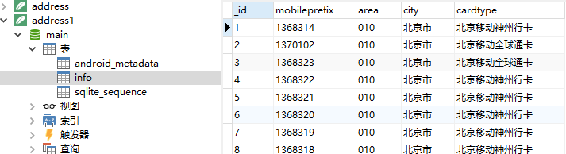
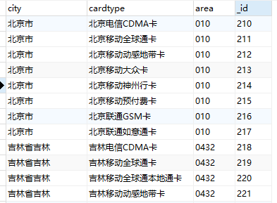
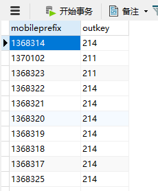
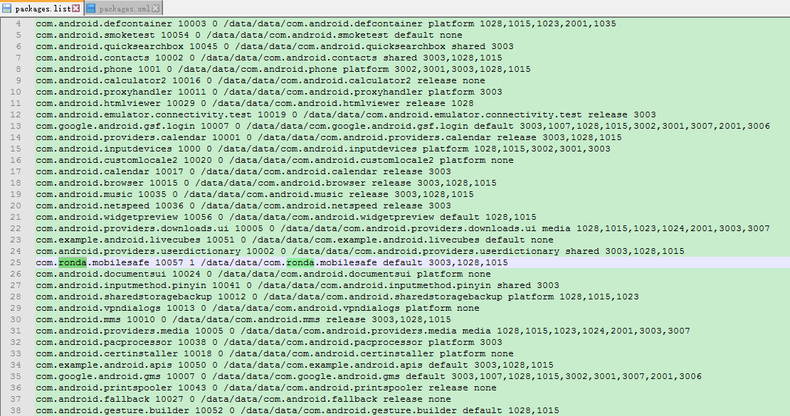
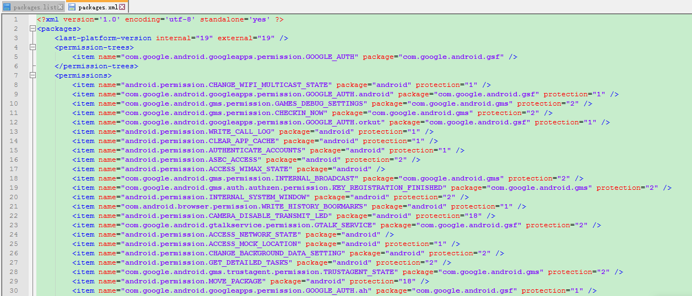
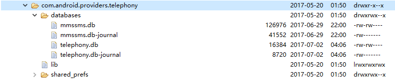
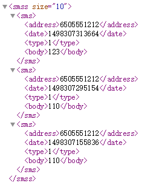

# 手机卫士52期笔记 #

## 代码组织结构 ##

- 根据业务逻辑划分(javaEE开发推荐此方法)

	- 办公软件

		- 出差 com.itheima.travel
		- 工资 com.itheima.money
		- 会议 com.itheima.meeting

	- 网盘

		- 上传 com.vdisk.upload
		- 下载 com.vdisk.download
		- 分享 com.vdisk.share

- 根据功能模块划分(Android开发推荐此方法)

	- Activity com.itheima.mobilesafe.activty
	- 后台服务  com.itheima.mobilesafe.service
	- 广播接受者 com.itheima.mobilesafe.receiver
	- 数据库 com.itheima.mobilesafe.db.dao
	- 对象(java bean) com.itheima.mobilesafe.domain/bean
	- 自定义控件 com.itheima.mobilesafe.view
	- 工具类 com.itheima.mobilesafe.utils
	- 业务逻辑 com.itheima.mobilesafe.engine --> 把一个关联类较多，逻辑比较复杂的、特殊的业务逻辑提取出来专门处理

- JavaEE和Android开发代码组织结构不同的原因：
	- 对于Android开发来说，其业务逻辑一般不会很复杂，主要是各种界面的调转，更倾向于代码层面，而不是业务逻辑
	- 而对于JavaEE来说，很多代码都与业务逻辑有关(算法等)，更倾向于业务逻辑，而
	- 不是代码层面。

## 项目创建 ##

- minimum SDK 要求最低的安装版本, 安装apk前,系统会判断当前版本是否高于(包含)此版本, 是的话才允许安装

- maxSdkVersion 限制安装此应用程序的最高sdk版本(一般不用)

- Target SDK 目标SDK, 一般设置为开发时使用的手机版本, 这样的话,系统在运行我的apk时,就认为我已经在该做了充分的测试, 系统就不会做过多的兼容性判断, 从而提高运行效率

- Compile With 编译程序时使用的版本

## 闪屏页面(Splash) ##

- 展示logo,公司品牌
- 项目初始化
- 检测版本更新
- 校验程序合法性(比如:判断是否有网络,有的话才运行)

每个Android应用启动之后都会出现一个Splash启动界面，显示产品的LOGO、公司的LOGO或者开发者信息。如果应用程序启动时间比较长，那么启动界面就是一个很好的东西，可以让用户耐心等待这段枯燥的时间。

制作Splash界面
突出产品LOGO，产品名称，产品主要特色；
注明产品的版本信息；
注明公司信息或者开发者信息；
背景图片，亦可以用背景颜色代替；

除了等待还能做点什么
大多数的Splash界面都是会等待一定时间，然后切换到下一个界面；
其实，在这段时间里，可以对系统状况进行检测，比如网络是否通，电源是否充足；
或者，预先加载相关数据；
为了能让启动界面展现时间固定，需要计算执行以上预处理任务所花费的时间，那么：启动界面SLEEP的时间=固定时间-预处理任务时间

## 什么是奋斗 ##

> 奋斗就是,你每天都很辛苦, 但是,你一年一年会越来越轻松
> 不奋斗就是, 你每天都很轻松, 但是,你一年一年会越来越辛苦

## 签名冲突 ##

> 如果两个应用程序, 包名相同, 但是签名不同, 就无法覆盖安装

> 正式签名

	1. 有效期比较长,一般大于25年
	2. 需要设置密码
	3. 正式发布应用时,必须用正式签名来打包

> 测试签名(debug.keystore)

	1. 有效期是1年,很短
	2. 有默认的别名,密码, alias=android, 密码是androiddebugkey
	3. 在eclipse中直接运行项目是,系统默认采用此签名文件

> 如果正式签名丢失了怎么办?

	1. 修改包名, 发布, 会发现有两个手机卫士, 用户会比较纠结
	2. 请用户先删掉原来的版本,再进行安装, 用户会流失
	3. 作为一名有经验的开发人员,请不要犯这种低级错误

## 常用快捷键 ##

- ctrl + shift + o 导包
- ctrl + shift + t 快速查找某个类
- 先按ctrl + 2 ,再点L, 创建变量并命名
- ctrl + o , 在当前类中,快速查找某个方法
- ctrl + k, 向下查找某个字符串
- ctrl + shift + k, 向上查找某个字符串
- alt + 左方向键 跳转上一个页面

## 对话框的Context ##

> 子类拥有父类的所有方法, 而且可以有更多自己的方法

> Activity(token), Context(没有token)
> 平时,要获取context对象的话, 优先选择Activity, 避免bug出现, 尽量不用getApplicationContext()

## Root权限 ##

> 什么是Root权限? Root权限相当于系统管理员权限, 有了root权限,就可以随意修改和删除手机内部的文件. 

> 一般手机购买之后, 都没有root权限. 厂商考虑到安全性因素,不允许用户或者第三方app删除和修改手机的内部文件(当然,sdcard的内容可以随意修改,不需要root权限)

> 如何获取root权限?
> 可以用第三方软件,比如刷机大师等. 一键root

> 有了Root后可以干嘛?
> 1. 刷机
> 2. 删除手机内置的app
> 3. 访问data/data目录的文件,并进行修改

> 怎么才能知道手机有么有root?
> 1. 刷机大师(小白用户用此方法)
> 2. 查看是否可以访问data/data目录,如果可以,就说明已经root了
> 3. cmd命令行,运行adb shell, 如果显示#,表示已经root, 如果显示$,表示没有root(如果用真机运行,即使root了,也显示$,这时候,运行命令su,可以直接获取管理员权限)

## MD5 ##

> 计算字符串或文件的特征码(数字指纹), 不可逆, 因为任何文件或字符串算出来的md5都是32位!

> 数据库: 123456->e10adc3949ba59abbe56e057f20f883e
> 654321->e10adc3949ba59abbe56e057f20f883e

> 在线破解网站: http://www.cmd5.com/

> 对MD5进行"加盐"处理, 增强安全性
> MD5(password)->MD5(password + 用户昵称 + 用户id...)

## .9.png(9-Patch) ##

> 通过黑色边线来描述图片的拉伸情况和填充文字的方式
> 上边线表示图片水平拉伸, 左边线表示垂直拉伸
> 右边线表示垂直填充区域, 下边线表示水平填充区域

## 读取联系人
    /**
     * 读取联系人的姓名和手机号码
     * 需要 READ_CONTACTS 权限
     *
     * @return
     */
    private List<Map<String, String>> readContact() {

        // 首先，从 raw_contacts 中读取联系人的id("contact_id")
        // 其次，根据 contact_id 从 data 表中查询出相应的电话号码和联系人名称
        // 然后，根据 mimetype 来区分哪个是联系人名称，哪个是电话号码

        Uri rawContactsUri = Uri.parse("content://com.android.contacts/raw_contacts"); // raw_contacts 是表名
        Uri dataUri = Uri.parse("content://com.android.contacts/data"); // data 是表名

        List<Map<String, String>> list = new ArrayList<>();

        // 查询 raw_contacts 表
        Cursor rawContactsCursor = getContentResolver().query(rawContactsUri, new String[]{"contact_id"}, null, null, null);
        if (rawContactsCursor != null) {
            while (rawContactsCursor.moveToNext()) {
                String contactId = rawContactsCursor.getString(0);
                KLog.e("contact_id: " + contactId);

                // 根据 contact_id 查询 data 表的记录, 实际上查询的是 view_data 视图， data 表本身是没有 contact_id 和 mimetype 字段的，但是 view_data 视图中有所有与 data 表关联的字段
                Cursor dataCursor = getContentResolver().query(dataUri, new String[]{"data1", "mimetype"}, "contact_id=?", new String[]{contactId}, null);
                if (dataCursor != null) {
                    Map<String, String> map = new HashMap<>();
                    while (dataCursor.moveToNext()) {
                        String data1 = dataCursor.getString(0);
                        String mimetype = dataCursor.getString(1);
                        KLog.i("data1: " + data1 + ", mimetype: " + mimetype);

                        if ("vnd.android.cursor.item/name".equals(mimetype)) {
                            map.put("name", data1);
                        } else if ("vnd.android.cursor.item/phone_v2".equals(mimetype)) {
                            map.put("phone", data1);
                        }
                    }
                    list.add(map);
                    dataCursor.close(); // 关闭cursor
                }
            }
            rawContactsCursor.close(); // 关闭cursor
        }
        return list;
    }

## 状态选择器(selector) ##

	<?xml version="1.0" encoding="utf-8"?>
	<selector xmlns:android="http://schemas.android.com/apk/res/android">
	
	    <item android:drawable="@drawable/function_greenbutton_pressed" android:state_pressed="true"/>//按下的图片
	    <!-- pressed -->
	    <item android:drawable="@drawable/function_greenbutton_pressed" android:state_focused="true"/>//获取焦点的图片
	    <!-- focused -->
	    <item android:drawable="@drawable/function_greenbutton_normal"/>
	    <!-- default -->//默认图片
	
	</selector>

	 <Button
            android:background="@drawable/btn_green_selector"
       />//将选择器设置给Button

## 手势滑动
	private GestureDetector mDetector; // 手势检测器
    
    // 创建手势检测器
	mDetector = new GestureDetector(this, new GestureDetector.SimpleOnGestureListener() {
        // 监听手势投掷事件，e1,e2分别表示滑动的起点和终点。velocityX和velocityY分别表示水平速度和垂直速度
        @Override
        public boolean onFling(MotionEvent e1, MotionEvent e2, float velocityX, float velocityY) {
            // 判断纵向滑动幅度是否过大, 过大的话不允许切换界面
            if (Math.abs(e1.getRawY() - e2.getRawY()) > 100) {
                Toast.makeText(BaseSetupActivity.this, "不允许这样滑哦！", Toast.LENGTH_SHORT).show();
                return true;
            }

            // 判断滑动是否过慢
            if (Math.abs(velocityX) < 100) {
                Toast.makeText(BaseSetupActivity.this, "滑动的太慢了！", Toast.LENGTH_SHORT).show();
                return true;
            }

            // 向右滑，上一页
            if (e2.getRawX() - e1.getRawX() > 200) {
                showPreviousPage();
            }

            // 向左滑，下一页
            if (e1.getRawX() - e2.getRawX() > 200) {
                showNextPage();
            }

            return super.onFling(e1, e2, velocityX, velocityY);
        }
    });
    
    @Override
    public boolean onTouchEvent(MotionEvent event) {
        return mDetector.onTouchEvent(event);
    }

## 短信发送
* 短信的发送其实就是使用 SmsManager.sendTextMessage() 方法
* 权限 android.permission.SEND_SMS

    // 发送短信给安全号码
    SmsManager smsManager = SmsManager.getDefault();
    /**
     * sendTextMessage(String destinationAddress, String scAddress, String text, PendingIntent sentIntent, PendingIntent deliveryIntent)
     * destinationAddress: 目的地址，即短信的接收方号码
     * scAddress: 如果为null, 则使用当前默认的 SMSC
     * text: 发送的内容文本
     * sentIntent: 发送的Intent，发送成功与否的结果
     * deliveryIntent: 交付，投递的Intent，接收成功与否的结果
     */
    smsManager.sendTextMessage(phone, null, "sim card changed!", null, null);// 模拟器只能识别英文，中文会乱码
    
## 短信拦截
* 手机能够接收到短信，其实就是系统内置的短信APP的原因
* 短信拦截的原理：接收短信的原理，本质上就是接收短信的广播。所以我们要求我们自己开发的APP要在系统短信APP前接收到短信的广播，然后再中断该广播的传递（但是在Android4.4之后就不再适用了）

权限：

	<!-- 发送短信的权限 -->
    <uses-permission android:name="android.permission.SEND_SMS"/>
    <!-- 接收短信的权限 -->
    <uses-permission android:name="android.permission.RECEIVE_SMS"/>

manifest中注册

    <receiver android:name=".receiver.SmsReceiver">

        <!-- 设置优先级，要比系统的优先级要高，这样才可以在系统前拦截. 虽然google规定priority的最大值为1000，但是超过1000也是有效的。为了保险起见，这里的值设为Integer.MAX_VALUE,即 2147483647 -->
        <intent-filter android:priority="2147483647">
            <action android:name="android.provider.Telephony.SMS_RECEIVED"/>
        </intent-filter>
    </receiver>
        
java代码实现：

	/**
	 * 拦截短信
	 * 众所周知Android在4.4上增加了不少安全措施，除了把SELinux设置为enforce外，在短信方向也加强了限制。
	 * 4.4之后，新增了一个default sms的机制
	 * 简而言之，就是如果要在4.4之后实现短信拦截功能，就必须成为default sms，把所有短信相关的功能都包揽了，然后再做短信拦截。
	 * 但这种做法，适配性和兼容性的工作是非常巨大的，短信、wapush（多种）、彩信、单双卡等等，相当于要求短信拦截类的软件要集成一个功能非常完善的通讯录类应用的功能。
	 * 

	 * 4.4以上有两种短信广播，一种必须成为系统短信应用才能收到 另一种只要声明权限即可 android.provider.Telephony.SMS_DELIVER  默认短信应用才可以收到、阻断 android.provider.Telephony.SMS_RECEIVED
	 * 只要注册声明权限即可收到、阻断想要阻断短信通知必须成为系统默认短信应用，并且阻断两种广播才能做到
	 */
    public class SmsReceiver extends BroadcastReceiver {
        @Override
        public void onReceive(Context context, Intent intent) {

            System.out.println(intent.getExtras().get("pdus")); //[Ljava.lang.Object;@9d3ec850
            System.out.println((intent.getExtras().get("pdus")).getClass().isArray()); // true
            System.out.println((intent.getExtras().get("pdus")) instanceof  Object[]); // true
            System.out.println((intent.getExtras().get("pdus")) instanceof  byte[]); // false

            // TODO: 2017/5/28/0028  这里的短信接收很奇怪，我在模拟器中测试的现象：当短信过长时，会被拆分成多条，但是 onReceive() 也是被调用多次的。而且此时短信的内容会变掉，很奇怪。而且下面的for循环永远只循环一次。
            Object[] pdus = (Object[]) intent.getExtras().get("pdus");

            // 短信最多140字节, 超出的话,会分为多条短信发送,所以是一个数组,因为我们的短信指令很短,所以for循环只执行一次。// TODO: 2017/5/28/0028 感觉这里的说法是有问题的。 和我测试的现象有区别。
            for (Object pdu : pdus) {
                System.out.println(pdu instanceof  byte[]); // true

                SmsMessage message = SmsMessage.createFromPdu((byte[]) pdu);
                String originatingAddress = message.getOriginatingAddress(); // 短信来源号码
                String messageBody = message.getMessageBody(); // 短信内容
                String date = new Date(message.getTimestampMillis()).toLocaleString();//发送时间

                KLog.e(originatingAddress + " : " + messageBody);

                if ("#*alarm*#".equals(messageBody)) {
                    // 播放报警音乐, 即使手机调为静音,也能播放音乐, 因为使用的是媒体声音的通道,和铃声无关。 媒体音乐，铃声，以及闹钟是三个相互独立的声音系统
                    MediaPlayer player = MediaPlayer.create(context, R.raw.ylzs);
                    player.setVolume(1f, 1f); // 左右声道
                    player.setLooping(true); // 循环播放
                    player.start();

                    // 中断短信广播的传递, 从而系统短信app就收不到内容了
                    // TODO: 2017/5/29/0029 在Android4.4及之后的版本的系统，这里的中断短信的广播传递就无效了，手机还是可以收到短信的，即使在Manifest中注册广播时设置最大优先级也是没有用的
                    abortBroadcast();
                }
            }

        }
    }
    
## 定位
常识：
经度: longitude  -180~180
纬度: latitude  -90~90
经度的起点为本初子午线，规定以过伦敦格林威治天文台的那条经线为0度经线，即本初子午线。

> 常见的几种定位方式：
> 1. 网络定位：就是根据IP定位。IP地址和实际生活中的地址形成一个数据库，可以根据IP在数据库中查出具体地址。警方破案使用的就是这种方法
>	缺点：IP地址动态分配，会导致定位不精确
> 2. 基站定位：范围比较广，几百米到几公里不等
> 3. GPS定位，定位一个点至少需要3颗卫星。GPS使用24颗卫星，基本可以覆盖全球90%的区域。范围：几米~几十米
> 	缺点：容易受云层，建筑等干扰
> 4. A-GPS辅助定位系统，通过网络和GPS共同定位，一般Android手机都采用此种定位方式。范围：几米~几十米

    public class LocationService extends Service {

        private LocationManager locationManager;
        private MyLocationListener myLocationListener;
        private SharedPreferences preferences;

        @Nullable
        @Override
        public IBinder onBind(Intent intent) {
            return null;
        }

        @Override
        public void onCreate() {
            super.onCreate();

            locationManager = (LocationManager) getSystemService(Context.LOCATION_SERVICE);

            //List<String> allProviders = locationManager.getAllProviders();
            //System.out.println(allProviders);  //[passive, gps, network]. 表示支持GPS，网络定位。passive比较特殊，直接读取其他应用的定位信息

            myLocationListener = new MyLocationListener();

            // API23及以上需要动态申请定位权限
    //		if (Build.VERSION.SDK_INT >= Build.VERSION_CODES.M
    //                && ActivityCompat.checkSelfPermission(this, Manifest.permission.ACCESS_FINE_LOCATION) != PackageManager.PERMISSION_GRANTED
    //                && ActivityCompat.checkSelfPermission(this, Manifest.permission.ACCESS_COARSE_LOCATION) != PackageManager.PERMISSION_GRANTED) {
    //            ActivityCompat.requestPermissions(this, new String[]{Manifest.permission.ACCESS_FINE_LOCATION, Manifest.permission.ACCESS_COARSE_LOCATION}, 0);
    //            // requestPermissions(new String[]{Manifest.permission.ACCESS_FINE_LOCATION, Manifest.permission.ACCESS_COARSE_LOCATION}, 0); // 直接调用Activity中的这个方法。也是可以的
    //            return;
    //        }

            // TODO: 2017/5/31/0031  LocationManager 的 requestLocationUpdates() 在国内是没有效果的。原因在于：该方法使用的是Google的位置服务，而google的服务在国内是用不了的，并且国内的android系统又进行了各种深度定制。
            // todo 所以该方法注册的 LocationListener 监听器是不会调用的.
            // todo 解决方法：使用第三方的地图，eg:百度地图，高德地图等
            // locationManager.requestLocationUpdates(LocationManager.GPS_PROVIDER, 0, 0, myLocationListener); // 使用GPS Provider

            // 提供配置，系统根据用户的配置为用户选择一个最佳的 provider
            Criteria criteria = new Criteria();
            criteria.setCostAllowed(true);// 是否允许付费,比如使用3g网络定位
            criteria.setAccuracy(Criteria.ACCURACY_FINE); // 高精度
            criteria.setPowerRequirement(Criteria.POWER_LOW); //功耗类型选择
            String bestProvider = locationManager.getBestProvider(criteria, true);// 获取最佳位置提供者。criteria不能填null，否则出现异常
            locationManager.requestLocationUpdates(bestProvider, 0, 0, myLocationListener); // 使用最佳位置提供者
        }

    //	@Override
    //    public void onRequestPermissionsResult(int requestCode, @NonNull String[] permissions, @NonNull int[] grantResults) {
    //        super.onRequestPermissionsResult(requestCode, permissions, grantResults);
    //        if (requestCode == 0) {
    //            if (grantResults[0] == PackageManager.PERMISSION_GRANTED && grantResults[1] == PackageManager.PERMISSION_GRANTED){
    //
    //            }
    //        }
    //    }

        class MyLocationListener implements LocationListener {

            // 位置发生变化调用
            @Override
            public void onLocationChanged(Location location) {
                System.out.println("onLocationChanged");

                double longitude = location.getLongitude(); // 经度
                double latitude = location.getLatitude(); // 维度
                double altitude = location.getAltitude(); // 海拔
                float accuracy = location.getAccuracy(); // 精确度
                float speed = location.getSpeed(); // 速度
                float bearing = location.getBearing(); // 方向
                KLog.i("经度: " + longitude + ", latitude: " + latitude + ", 海拔:" + altitude + ", accuracy: " + accuracy);

                preferences = getSharedPreferences("config", Context.MODE_PRIVATE);

                preferences
                        .edit()
                        .putString("location", "j:"+location.getLongitude()+"; w:"+location.getLatitude()) // 保存经纬度信息
                        .commit();

                stopSelf(); //当保存完经纬度信息后，停掉service，节省资源
            }

            // 位置提供者状态发生变化. eg:被建筑物挡住时，突然间获取不到位置时
            @Override
            public void onStatusChanged(String provider, int status, Bundle extras) {
                System.out.println("onStatusChanged");
            }

            // 用户打开gps
            @Override
            public void onProviderEnabled(String provider) {
                System.out.println("onProviderEnabled");
            }

            // 用户关闭gps
            @Override
            public void onProviderDisabled(String provider) {
                System.out.println("onProviderDisabled");
            }
        }

        @Override
        public void onDestroy() {
            super.onDestroy();
            locationManager.removeUpdates(myLocationListener); // 停止更新位置，节省电量
        }
    }

权限：

    <uses-permission android:name="android.permission.INTERNET"/>
    <uses-permission android:name="android.permission.ACCESS_COARSE_LOCATION"/>
    <uses-permission android:name="android.permission.ACCESS_FINE_LOCATION"/>

* 火星坐标系统
我们使用以上方法获取到的经纬度是真实的经纬度，但是如果我们使用Google地图查询对应的位置的话，会发现有偏差现象。这时就引入了火星坐标系统。
火星坐标系统是一种国家保密插件，也叫做加密插件或者加偏或者SM模组，其实就是对真实坐标系统进行人为的加偏处理，按照特殊的算法，将真实的坐标加密成虚假的坐标，而这个加偏并不是线性的加偏，所以各地的偏移情况都会有所不同。而加密后的坐标也常被人称为火星坐标系统。
有的电子地图、导航设备，都需要加入国家保密插件。第一步，地图公司测绘地图，测绘完成后，送到国家测绘局，将真实坐标的电子地图，加密成“火星坐标”，这样的地图才是可以出版和发布的，然后才可以让GPS公司处理。第二步，所有的GPS公司，只要需要汽车导航的，需要用到导航电子地图的，都需要在软件中加入国家保密算法，将COM口读出来的真实的坐标信号，加密转换成国家要求的保密的坐标。这样，GPS导航仪和导航电子地图就可以完全匹配，GPS也就可以正常工作了。

## 常用网站 ##

http://www.androiddevtools.cn/

## 一键锁屏和清除数据
* 主要与 android.app.admin 包有关
* 官方文档：https://developer.android.google.cn/guide/topics/admin/device-admin.html

1. 创建 DeviceAdminReceiver.(空实现即可)

        public class AdminReceiver extends DeviceAdminReceiver {
        }

2. 并在Manifest中注册

        <receiver android:name=".receiver.AdminReceiver"
                  android:label="@string/sample_device_admin"
                  android:description="@string/sample_device_admin_description"
                  android:permission="android.permission.BIND_DEVICE_ADMIN">
            <meta-data android:name="android.app.device_admin"
                       android:resource="@xml/device_admin_sample" />
            <intent-filter>
                <action android:name="android.app.action.DEVICE_ADMIN_ENABLED" />
            </intent-filter>
        </receiver>
3. 激活，一键锁屏，清除数据，卸载操作

        public class MainActivity extends AppCompatActivity {

            private ComponentName mDeviceAdminSample;
            private DevicePolicyManager mDPM;

            @Override
            protected void onCreate(Bundle savedInstanceState) {
                super.onCreate(savedInstanceState);
                setContentView(R.layout.activity_main);

                // 获取设备策略服务
                mDPM = (DevicePolicyManager) getSystemService(Context.DEVICE_POLICY_SERVICE);
                // 设备管理组件
                mDeviceAdminSample = new ComponentName(this, AdminReceiver.class);

            }

            // 激活 按钮
            // 激活设备管理器, 也可以在设置->安全->设备管理器中手动激活
            public void active(View view) {
                Intent intent = new Intent(DevicePolicyManager.ACTION_ADD_DEVICE_ADMIN);

                intent.putExtra(DevicePolicyManager.EXTRA_DEVICE_ADMIN, mDeviceAdminSample);
                intent.putExtra(DevicePolicyManager.EXTRA_ADD_EXPLANATION, "哈哈哈, 我们有了超级设备管理器, 好NB!");
                startActivity(intent);
            }

            // 一键锁屏 按钮
            public void lockScreen(View view) {

                if (mDPM.isAdminActive(mDeviceAdminSample)) { // 判断设备管理器是否已经激活
                    mDPM.lockNow();
                    mDPM.resetPassword("123", 0); // 设置锁屏密码
                } else {
                    Toast.makeText(this, "必须先激活设备管理器", Toast.LENGTH_SHORT).show();
                }

            }

            // 清除数据 按钮
            public void clearData(View view) {

                if (mDPM.isAdminActive(mDeviceAdminSample)) {
                    mDPM.wipeData(DevicePolicyManager.WIPE_RESET_PROTECTION_DATA); // 清除数据,恢复出厂设置(不包括SD卡)
                } else {
                    Toast.makeText(this, "必须先激活设备管理器!", Toast.LENGTH_SHORT).show();
                }
            }

            // 卸载 按钮
            // 在设置->安全->设备管理器中激活的应用程序，直接卸载是卸载不了的。必须要先取消激活才可以卸载
            public void uninstall(View view) {

                if (mDPM.isAdminActive(mDeviceAdminSample)) {
                    mDPM.removeActiveAdmin(mDeviceAdminSample); // 取消激活,这样才可以卸载
                }
                // 卸载程序
                Intent intent = new Intent(Intent.ACTION_DELETE);
                intent.addCategory(Intent.CATEGORY_DEFAULT);
                intent.setData(Uri.parse("package:" + getPackageName()));
                startActivity(intent);
            }
        }
        
## 来电归属地查询(手机号码只需要前7位就可以确定其归属地 )
1. 网络平台查询
2. 本地数据库查询
  先看一下数据库中的表是什么样的：

  

  可以发现该表中有很多内容字段：area,city,cardtype等。导致这个表比较冗余，所以这个数据库就有16.7M
  现在可以对这个表进行优化，拆分成两个表：

        

  这样这个数据库就一下子减少到3M多了
  
  使用步骤：
  * project视图，在main目录下创建一个assets文件夹（可以直接创建一个文件夹，起名为assets; 也可以右键main目录 -->new --> Folder --> Aseets Folder）【assets目录经常放一些与项目没有什么关系的文件：eg: .db等】 
  * 在启动页中拷贝assets目录下的数据库文件到data/data目录下

    copyDB("address.db"); // 拷贝归属地查询数据库

	//.....
    private void copyDB(String DBName) {
        InputStream in = null;
        OutputStream out = null;
        File destFile = new File(getFilesDir(), DBName);

        if (destFile.exists()) {
            KLog.w("数据库" + DBName + "已存在！");
            return;
        }

        try {
            in = getAssets().open(DBName);
            out = new FileOutputStream(destFile);
            KLog.i("files: " + destFile.toString());

            int len;
            byte[] buf = new byte[1024];
            while ((len = in.read(buf)) != -1) {
                out.write(buf, 0, len);
            }
        } catch (IOException e) {
            e.printStackTrace();
        } finally {
            try {
                if (in != null) {
                    in.close();
                }
                if (out != null) {
                    out.close();
                }
            } catch (IOException e) {
                e.printStackTrace();
            }
        }

    }

数据库操作Dao层的写法：

	public class AddressDao {
	
	    private static final String PATH = "data/data/com.ronda.mobilesafe/files/address.db";
	
	    public static String getAddress(String number) {
	        String address = "未知号码";
	
	        // 注意：openDatabase()方法只能访问data/data目录下的数据库，所以这里的形参path只能是data/data/目录下的数据库，不能是项目中的资源文件，也不能是assets目录下的文件,否则数据库访问不到。所以需要做数据库的拷贝
	        SQLiteDatabase database = SQLiteDatabase.openDatabase(PATH, null, SQLiteDatabase.OPEN_READONLY); // 只读的方式打开数据库
	
	        // 手机号码的特点：1 + (3,4,5,6,7,8) + 后面的9位数字
	        // 正则表达式：^1[3-8]\d{9}$
	        if (number.matches("^1[3-8]\\d{9}")) {// 如果是手机号码，则查询数据库
	
	            Cursor cursor = database.rawQuery("SELECT location FROM data2 WHERE id = (SELECT outkey FROM data1 WHERE id = ?)", new String[]{number.substring(0, 7)});
	            if (cursor.moveToNext()) { // cursor 的结果集就只有一行，所以使用if，而非while
	                address = cursor.getString(0);
	            }
	            cursor.close();
	        } else if (number.matches("^\\d+$")) { // 匹配数字
	            switch (number.length()) {
	                case 3://若是比较正式的话，需要查询报警电话的数据库。下面的判断也是一样
	                    address = "报警电话";
	                    break;
	                case 4:
	                    address = "模拟器";
	                    break;
	                case 5:
	                    address = "客服电话";
	                    break;
	                case 7:
	                case 8:
	                    address = "本地电话";
	                    break;
	                default:
	                    // 01088881234
	                    // 048388888888
	                    if (number.startsWith("0") && number.length() > 10) { // 可能是长途电话
	                        // 有些区号是4位，有些区号是3位（包括0）. 为保证查询数据的精确性，则先查询4位，再查询3位.(感觉区号查询不准确，因为同一个区号很可能会对应多个地区，多个电信公司)
	                        // 先查4位
	                        Cursor cursor = database.rawQuery("SELECT location FROM data2 WHERE area = ?", new String[]{number.substring(1, 4)});
	                        if (cursor.moveToNext()) {
	                            address = cursor.getString(0);
	                        } else {
	                            cursor.close();
	
	                            // 查询3位区号
	                            cursor = database.rawQuery("SELECT location FROM data2 WHERE area = ?", new String[]{number.substring(1, 3)});
	                            if (cursor.moveToNext()) {
	                                address = cursor.getString(0);
	                            }
	                            cursor.close();
	                        }
	                    }
	            }
	        }
	        database.close();
	        return address;
	    }
	}
  
  
## 插补器原理
先来看看我们如何在Android中加载一个动画：

    Animation shake = AnimationUtils.loadAnimation(this, R.anim.shake);
    // 这里的Interpolator是一个接口，getInterpolation()的新参就相当于数学函数中的x, 返回值相当于y,就是一个x对y的函数
    // eg：LinearInterpolator 类的实现y=x; CycleInterpolator 类中的实现就是一个正弦函数
    shake.setInterpolator(new Interpolator() {
        @Override
        public float getInterpolation(float input) {
            return 0;
        }
    });
    mEtNumber.startAnimation(shake);

从以上代码中就可以看到插补器 Interpolator 的原理，我们可以使用Interpolator接口实现一个我们自己的插补器效果。

## 手机震动（Vibrator）

    /**
     * 手机震动
     * 权限:android.permission.VIBRATE
     */
    private void vibrate(){
        Vibrator vibrator = (Vibrator) getSystemService(Context.VIBRATOR_SERVICE);
        //vibrator.vibrate(2000);// 震动两秒

        /**
         * 参数1：是一个long类型的数组，值依次循环表示，turn off, turn on ...
         * 参数2：表示参数1这个震动组合数组是从哪个索引值开始循环重复震动，eg:若为1，则表示1,2,3 1,2,3...这种震动方式。-1表示只执行一次，不循环
         */
        vibrator.vibrate(new long[]{1000, 2000, 1000, 3000}, -1); // 先等待1秒，再震动2s，再等待1秒，再震动3s

        //vibrator.cancel(); // 取消震动
    }

## 来电监听 和 去电监听
* 来电监听：只能是用 TelephonyManager#listen(PhoneStateListener listener, int events) 来监听，而不能使用广播监听（没有相关API）
* 去电监听：使用广播。
	* 广播需要Action：android.intent.action.NEW_OUTGOING_CALL，
	* 并且还需要权限： android.permission.PROCESS_OUTGOING_CALLS.
* 为了是来电监听和去电监听统一管理，所以就放在了同一个Service服务中，便于同时开启和关闭。所以，这里去电监听的广播使用的是动态注册，而非静态注册。

代码如下：

	/**
	 * 来电提醒的服务
	 * 注意: 这个服务目前是只有进入app中的设置中心中，手动开启电话归属地显示，才可以启动这个服务。
	 * 要想程序一启动就开启这个服务，则可以在SplashActivity中启动这个服务。
	 */
	public class AddressService extends Service {
	
	    private TelephonyManager mTelephonyManager;
	    private MyListener mListener;
	    private OutCallReceiver mOutCallReceiver;
	    private WindowManager mWM;
	    private View mToastView;
	    private SharedPreferences mPreferences;
	    private int startX;
	    private int startY;
	
	    @Override
	    public IBinder onBind(Intent intent) {
	        return null;
	    }
	
	    @Override
	    public void onCreate() {
	        super.onCreate();
	
	        mPreferences = this.getSharedPreferences("config", Context.MODE_PRIVATE);
	
	        mTelephonyManager = (TelephonyManager) getSystemService(Context.TELEPHONY_SERVICE);
	
	        mListener = new MyListener();
	        /**
	         * 参数2：这个events标识会回调 PhoneStateListener#onCallStateChanged()方法。若想监听多个状态，只需把这几个状态相加即可，因为这些状态都刚好是2的n次方. 然后就会回调PhoneStateListener中相应的方法
	         *   参数2是与参数1相关，所以这里的值是引用定义在 PhoneStateListener 中的常量，而不是定义在 TelephonyManager
	         */
	        mTelephonyManager.listen(mListener, PhoneStateListener.LISTEN_CALL_STATE); //监听来电的状态
	
	        mOutCallReceiver = new OutCallReceiver();
	        IntentFilter filter = new IntentFilter(Intent.ACTION_NEW_OUTGOING_CALL);
	        this.registerReceiver(mOutCallReceiver, filter); // 动态注册去电监听的广播
	    }
	
	    @Override
	    public void onDestroy() {
	        super.onDestroy();
	        mTelephonyManager.listen(mListener, PhoneStateListener.LISTEN_NONE);
	
	        this.unregisterReceiver(mOutCallReceiver); // 注销广播
	    }
	
	    class MyListener extends PhoneStateListener {
	        /**
	         * state 有下面三种状态：
	         * TelephonyManager#CALL_STATE_IDLE (空闲)
	         * TelephonyManager#CALL_STATE_RINGING (响铃)
	         * TelephonyManager#CALL_STATE_OFFHOOK (摘机状态，电话机拿起听筒或按免提)
	         * 

	         * incomingNumber: 表示来电的号码
	         */
	        @Override
	        public void onCallStateChanged(int state, String incomingNumber) {
	            super.onCallStateChanged(state, incomingNumber);
	
	            KLog.w("state:" + state + "incomingNumber: " + incomingNumber);
	
	            switch (state) {
	                case TelephonyManager.CALL_STATE_RINGING: // 电话铃声响了
	                    String address = AddressDao.getAddress(incomingNumber); // 根据来电号码查询归属地
	                    //Toast.makeText(AddressService.this, address, Toast.LENGTH_SHORT).show();
	                    showToast(address);
	                    break;
	                case TelephonyManager.CALL_STATE_IDLE: // 电话闲置状态
	                    if (mWM != null && mToastView != null) {
	                        mWM.removeViewImmediate(mToastView); // 从window中移除view
	                        mToastView = null;
	                    }
	                    break;
	            }
	        }
	    }
	
	
	    /**
	     * 监听去电的广播接受者
	     * 需要权限：android.permission.PROCESS_OUTGOING_CALLS
	     * 为了和来电监听绑定在一起，则需要在 AddressService 中动态注册和注销 OutCallReceiver
	     */
	    class OutCallReceiver extends BroadcastReceiver {
	
	        @Override
	        public void onReceive(Context context, Intent intent) {
	
	            String number = getResultData(); // 获取去电号码. 注意：这个值在平常的时候经常为null
	            KLog.w("number : " + number);
	
	            String address = AddressDao.getAddress(number);
	
	            //Toast.makeText(context, address, Toast.LENGTH_SHORT).show();
	            showToast(address);
	        }
	    }
	
	
	    /**
	     * 自定义归属地浮窗显示
	     */
	    private void showToast(String text) {
	        mWM = (WindowManager) this.getSystemService(Context.WINDOW_SERVICE);
	
	        final WindowManager.LayoutParams params = new WindowManager.LayoutParams();
	        params.height = WindowManager.LayoutParams.WRAP_CONTENT;
	        params.width = WindowManager.LayoutParams.WRAP_CONTENT;
	        params.format = PixelFormat.TRANSLUCENT;
	        params.windowAnimations = android.R.style.Animation_Toast;
	        //params.type = WindowManager.LayoutParams.TYPE_TOAST; // 若是单纯的触摸交互的话，TYPE_TOAST 和 TYPE_PHONE 都可以的，并且 TYPE_TOAST 更简单，不需要权限
	        params.type = WindowManager.LayoutParams.TYPE_PHONE; // 需要权限：android.permission.SYSTEM_ALERT_WINDOW.// 电话窗口。它用于电话交互（特别是呼入）。它置于所有应用程序之上
	        params.flags = WindowManager.LayoutParams.FLAG_KEEP_SCREEN_ON
	                | WindowManager.LayoutParams.FLAG_NOT_FOCUSABLE; // 这一个必须要加上，否则点击屏幕上的任何一处都会触发mToastView的onTouchEvent事件.原因就是一旦可以获取焦点就相当于普通的对话框了，一弹出来焦点就聚集在当前这个对话框了，屏幕上的其他地方都暗掉了，触摸整个屏幕就相当于触摸这个对话框
	        //| WindowManager.LayoutParams.FLAG_NOT_TOUCHABLE;// 要变成可触摸
	        params.gravity = Gravity.LEFT + Gravity.TOP; // Toast默认是居中的。这里把重心位置设置为左上角
	        params.setTitle("Toast");
	
	        int lastX = mPreferences.getInt("lastX", 0);
	        int lastY = mPreferences.getInt("lastY", 0);
	
	        // 设置浮窗的位置，基于左上方的偏移量
	        params.x = lastX;
	        params.y = lastY;
	
	        mToastView = LayoutInflater.from(this).inflate(R.layout.toast_address, null);
	
	        int styleIndex = mPreferences.getInt("address_style_index", 0);
	        int[] toastBgs = {R.drawable.call_locate_white, R.drawable.call_locate_orange,
	                R.drawable.call_locate_blue, R.drawable.call_locate_gray, R.drawable.call_locate_green};
	
	        mToastView.setBackgroundResource(toastBgs[styleIndex]);
	
	        TextView tvAddress = (TextView) mToastView.findViewById(R.id.tv_address); // 根据存储的样式的索引值更新背景
	        tvAddress.setText(text);
	        mWM.addView(mToastView, params);
	
	
	        final int screenWidth = mWM.getDefaultDisplay().getWidth(); //获取屏幕的宽度
	        final int screenHeight = mWM.getDefaultDisplay().getHeight(); // 获取屏幕的高度（包括statusBar，ActionBar，但是不包括NavigationBar）
	
	        mToastView.setOnTouchListener(new View.OnTouchListener() {
	            @Override
	            public boolean onTouch(View v, MotionEvent event) {
	                switch (event.getAction()) {
	                    case MotionEvent.ACTION_DOWN:
	                        // 初始化起点坐标
	                        startX = (int) event.getRawX();
	                        startY = (int) event.getRawY();
	                        break;
	                    case MotionEvent.ACTION_MOVE:
	                        int endX = (int) event.getRawX();
	                        int endY = (int) event.getRawY();
	
	                        // 计算移动偏移量
	                        int dx = endX - startX;
	                        int dy = endY - startY;
	
	                        // 更新浮窗位置
	                        params.x += dx;
	                        params.y += dy;
	
	                        // 防止坐标偏离屏幕。虽然在来电显示界面中的这个mToastView不会拖拽出屏幕，但是它的params.x和params.y会不断增加或减少
	                        if (params.x < 0) {
	                            params.x = 0;
	                        }
	
	                        if (params.y < 0) {
	                            params.y = 0;
	                        }
	
	                        if (params.x > screenWidth - mToastView.getWidth()) {
	                            params.x = screenWidth - mToastView.getWidth();
	                        }
	                        if (params.y >= screenHeight - mToastView.getHeight()) { // 这里不需要减去statusbar的高度，因为mToastView就显示在windowManager上，而不是状态栏之下，导航栏之上的区域
	                            params.y = screenHeight - mToastView.getHeight();
	                        }
	
	                        mWM.updateViewLayout(mToastView, params);
	
	                        // 重新初始化起点坐标
	                        startX = (int) event.getRawX();
	                        startY = (int) event.getRawY();
	                        break;
	                    case MotionEvent.ACTION_UP:
	                        SharedPreferences.Editor edit = mPreferences.edit();
	                        edit.putInt("lastX", params.x);
	                        edit.putInt("lastY", params.y);
	                        edit.commit();
	                        break;
	                }
	                return true;
	            }
	        });
	    }
	}

注意：来电监听这个服务是在设置界面中进行开启与关闭的。但是对于Service，用户是可以手动在设置中关闭，或者借助第三方的一键清理也可以关掉，不仅仅是由自己的程序控制的，所以这样就可能会造成Service的实际状态与显示的状态不同步的问题。所以在每次进入设置界面时就应该先判断Service的运行状态，然后在更新View

    /**
     * 初始化电话归属地开关
     */
    private void initAddressView() {
        mItemAddress = (SettingItemView) findViewById(R.id.siv_adderss);
        //mItemAddress.setChecked(mPreferences.getBoolean("address", true));

        // 电话归属地显示的服务，不能持久化保存状态，因为可以手动在 设置 --> 应用程序 中关掉服务，或者一键清理也可以结束后台任务，这时就产生了后台AddressService服务已停止，但是设置界面中仍然显示开启的状态，造成状态不同步（这里最合适的应该放在onResume()中，而不是onCreate()）
        // 所以当每次进入该界面时，应该先判断后台AddressService服务的运行状态，然后根据状态设置设置界面上的View的显示
        boolean isRunning = ServiceStateUtils.isServiceRunning(this, AddressService.class.getName()); // 把AddressService的完全限定名传过去
        mItemAddress.setChecked(isRunning);

        mItemAddress.setOnClickListener(new View.OnClickListener() {
            @Override
            public void onClick(View v) {
                boolean b = !mItemAddress.isChecked();
                mItemAddress.setChecked(b);

                Intent serviceIntent = new Intent(SettingActivity.this, AddressService.class);
                if (b) {
                    startService(serviceIntent); // 开启归属地服务
                } else {
                    stopService(serviceIntent); // 停止归属地服务
                }
            }
        });
    }

一个检测Service是否正在运行的工具类：

	public class ServiceStateUtils {
	    /**
	     * 检测服务是否正在运行
	     *
	     * @param context
	     * @param serviceName
	     * @return
	     */
	    public static boolean isServiceRunning(Context context, String serviceName) {
	
	        ActivityManager manager = (ActivityManager) context.getSystemService(Context.ACTIVITY_SERVICE);
	        List<ActivityManager.RunningServiceInfo> runningServices = manager.getRunningServices(100); // 获取系统所有正在运行的服务,最多返回100个,一般100个也就够了
	
	        KLog.w(serviceName);
	
	        for (ActivityManager.RunningServiceInfo runningService : runningServices) {
	            String className = runningService.service.getClassName();// 获取全限定名
	            if (className.equals(serviceName)) {
	                return true;
	            }
	        }
	        return false;
	    }
	}

## View的拖拽移动
> 原理：
> 
* 给View设置 setOnTouchListener() 监听，实时监听 ACTION_MOVE 动作， 计算当前的位置
* 调用view.layout(int l, int t, int r, int b) 更新绘制的位置。或者也可以使用setLayoutParams()来实现： view.setLayoutParams(params);  view.requestLayout(); //请求重新布局
* 注意：在onCreate()中一开始的时候，就不能使用view.layout()方法来给View初始化定位，因为此时界面都还未绘制。只能改View设置setLayoutParams()来定位View的初始化位置

*  View 的绘制流程： onMeasure()[测量view大小等] --> onLayout()[确定View的位置] --> onDraw()[View内容的绘制]

代码如下：

	public class DragViewActivity extends AppCompatActivity {
	
	    private TextView mTvTop;
	    private TextView mTvBottom;
	    private ImageView mIvDrag;
	    private int mStartX;
	    private int mStartY;
	    private SharedPreferences mPreferences;
	
	    @Override
	    protected void onCreate(Bundle savedInstanceState) {
	        super.onCreate(savedInstanceState);
	        setContentView(R.layout.activity_drag_view);
	
	        mPreferences = getSharedPreferences("config", Context.MODE_PRIVATE);
	
	        mTvTop = (TextView) findViewById(R.id.tv_top);
	        mTvBottom = (TextView) findViewById(R.id.tv_bottom);
	        mIvDrag = (ImageView) findViewById(R.id.iv_drag);
	
	        int lastX = mPreferences.getInt("lastX", 0);
	        int lastY = mPreferences.getInt("lastY", 0);
	
	        // getSize().  WindowManager 也可以使用 getSystemService(Context.WINDOW_SERVICE) 来获取
	        final int screenWidth = getWindowManager().getDefaultDisplay().getWidth(); //获取屏幕的宽度
	        final int screenHeight = getWindowManager().getDefaultDisplay().getHeight(); // 获取屏幕的高度（包括statusBar，ActionBar，但是不包括NavigationBar）
	
	        KLog.e("screenWidth: " + screenWidth + ", screenHeight: " + screenHeight);
	
	        // View 的绘制流程： onMeasure()[测量view大小等] --> onLayout()[确定View的位置] --> onDraw()[View内容的绘制]
	        // 注意：下面直接这样绘制mIvDrag的位置时没有效果的，因为这里是在onCreate()方法中，此时View都还没有调用 onMeasure()方法测量大小，所以getWidth()和getHeight()都为0。
	        // 解决方法：既然这里还不能调用layout方法重新定位位置，那么我们可以设置其layoutParams参数，这样View在显示过程中回调onLayout()方法时，就可以使用我们设置的layoutParams参数了
	        // mIvDrag.layout(lastX, lastY, mIvDrag.getWidth() + lastX, mIvDrag.getHeight() + lastY); // onCreate() 中还未测量View
	
	        RelativeLayout.LayoutParams params = (RelativeLayout.LayoutParams) mIvDrag.getLayoutParams(); // 获取布局参数
	        params.leftMargin = lastX;// 更新左边距
	        params.topMargin = lastY; // 更新上边距
	        mIvDrag.setLayoutParams(params); // 这句代码可加可不加，因为java中都是引用，而这个params是从mIvDrag中获取来的
	
	        mIvDrag.setOnTouchListener(new View.OnTouchListener() {
	            @Override
	            public boolean onTouch(View v, MotionEvent event) {
	
	                switch (event.getAction()) {
	                    case MotionEvent.ACTION_DOWN:
	                        // 初始化起点坐标
	                        mStartX = (int) event.getRawX();
	                        mStartY = (int) event.getRawY();
	                        break;
	                    case MotionEvent.ACTION_MOVE:
	                        int endX = (int) event.getRawX();
	                        int endY = (int) event.getRawY();
	
	                        //KLog.w("endX: " + endX + " endY: " + endY);
	
	                        // 计算移动偏移量
	                        int dx = endX - mStartX;
	                        int dy = endY - mStartY;
	
	                        // 更新左上右下距离
	                        int left = mIvDrag.getLeft() + dx;
	                        int top = mIvDrag.getTop() + dy;
	                        int right = mIvDrag.getRight() + dx;
	                        int bottom = mIvDrag.getBottom() + dy;
	
	                        // 判断是否超出屏幕边界, 注意状态栏的高度
	                        // screenHeight包括顶部的StatusBar，而layout()方法的形参其实就是layoutParams参数，而这个绘制的参考点是StatusBar和ActionBar下边部分的左上角的那个参考点
	                        if (left < 0 || right > screenWidth || top < 0 || bottom > screenHeight - SystemBarUtils.getStatusBarHeight(DragViewActivity.this)) {
	                            break;
	                        }
	
	                        // 根据DragView图片的位置,决定提示框显示和隐藏
	                        if (top >= (screenHeight - SystemBarUtils.getStatusBarHeight(DragViewActivity.this)) / 2) {// 上边显示,下边隐藏
	                            mTvTop.setVisibility(View.VISIBLE);
	                            mTvBottom.setVisibility(View.INVISIBLE);
	                        } else {
	                            mTvTop.setVisibility(View.INVISIBLE);
	                            mTvBottom.setVisibility(View.VISIBLE);
	                        }
	
	                        // 更新界面:调用layout()重新绘制mIvDrag的位置。
	                        // 其实也可以使用setLayoutParams()来实现： mIvDrag.setLayoutParams(params);  mIvDrag.requestLayout(); //请求重新布局
	                        mIvDrag.layout(left, top, right, bottom);
	
	                        // 重新初始化起点坐标
	                        mStartX = endX;
	                        mStartY = endY;
	                        break;
	                    case MotionEvent.ACTION_UP:
	                        // 持久化记录坐标点位置
	                        SharedPreferences.Editor editor = mPreferences.edit();
	                        editor.putInt("lastX", mIvDrag.getLeft());
	                        editor.putInt("lastY", mIvDrag.getTop());
	                        editor.commit();
	                        break;
	                }
	                return true; // 消费该事件
	            }
	        });
	    }
	}

## 半透明Activity背景的实现
分两种情况：

1. 继承自Activity
	* 在Manifest中设置Activity的主题为透明背景： android:theme="@android:style/Theme.Translucent.NoTitleBar"
	* 然后在布局的根标签设置半透明的颜色即可。eg:android:background="#5000"
2. 继承自AppCompatActivity
	* 此时只能使用 Theme.AppCompat 下的主题，但是由于该系列主题下并没有提供透明背景的主题。此时就只能自定义主题
	* 需要设置 android:windowIsTranslucent 为 true 和 android:windowBackground 为 @android:color/transparent

代码如下：

    <!--透明Activity背景的主题
    当我们的Activity继承自Activity本身时，可以直接使用android:theme="@android:style/Theme.Translucent.NoTitleBar"即可
    当继承自AppCompatActivity时，只能使用Theme.AppCompat下的主题。而这些主题并没有Translucent类似的主题。所以此时只能自定义主题
    -->
    

## 多击事件
android中有封装好的单击事件监听，那如何实现双击事件的监听呢？
    
	// 按两次退出
    private long mExitTime;

    private void twiceBack2Exit() {
        if (System.currentTimeMillis() - mExitTime > 1000) {
            Toast.makeText(this, "再按一次退出程序", Toast.LENGTH_SHORT).show();
            mExitTime = System.currentTimeMillis();
        } else {
            finish();
        }
    }

那么如何实现任何次数点击的事件监听呢？Google系统设置APP中有如下一段代码，写的比较好：
（mHits数组的长度为几就表示单击多少次，而时间间隔为500ms）

	final long[] mHits = new long[3];
    mIvDrag.setOnClickListener(new View.OnClickListener() {
        @Override
        public void onClick(View v) {
            System.arraycopy(mHits, 1, mHits, 0, mHits.length - 1);// 每次点击其实就是把mHits这个long类型的数组向前移动一位
            mHits[mHits.length - 1] = SystemClock.uptimeMillis(); // uptimeMillis() 从开机到现在的毫秒数（手机睡眠的时间不包括在内）
            if (mHits[0] >= (SystemClock.uptimeMillis() - 500)) {
                Toast.makeText(DragViewActivity.this, mHits.length + "击", Toast.LENGTH_SHORT).show();
            }
        }
    });

原理：
其实就是先声明一个long类型的数组，长度为要点击的次数，然后就是把每次点击的时间存到该数组中，最后当点击完毕后，就判断数组中的第一个元素和最后一个元素之间的差值是否在指定的时间范围之内。（这里的这个数组就相当于一个队列，每次添加数据就相当于push）

接下来介绍一下System.arrayCopy()方法：

    public static native void arraycopy(Object src,  int  srcPos,
                                        Object dest, int destPos,
                                        int length);
就是把src数组从srcPos位置开始，拷贝到dest数组中的destPos位置，拷贝长度为length。

总结：对于多击事件，要确定两个要素：多击的次数，多击的最大时间间隔。

## ListView 分页加载与分批加载
* 分批加载数据是为了解决用户体验的问题，
* 而分页加载是为了解决OOM的问题。（out of memery）
* QQ的聊天记录就是采用分页加载数据的，新数据会覆盖旧的数据，而分批加载数据，比如一次加载20条数据，加载20条之后再去加载新的数据。
* 其实分批和分页其实都可以使用一个接口，只是显示数据的方式是不同的，分批是追加数据，而分页是覆盖数据

## 取整
* Math.round(double a)  --> int : 四舍五入
* Math.ceil(double a) --> double : 向上取整
* Math.floor(double a) --> double : 向下取整

## View.inflate()
	// View.inflate(Context context, int resource, ViewGroup root)
	// 如果 root == null, 则等价于 inflater.inflate(resource, null, false) 也等价于 inflater.inflate(resource, null). layout_width 和 layout_height 是无效的
	// 如果 root != null， 则等价于 inflater.inflate(resource, root, true)
	// View.inflate() 有缺陷，不如使用 LayoutInflater.from().inflate()

## ListView适配器优化
初步优化如下所示：

	public View getView(int position, View convertView, ViewGroup parent) {
		ViewHolder holder;
		if (convertView == null) {
			convertView = mInflater.inflate(R.layout.list_item_icon_text, null);
			holder = new ViewHolder();
			holder.text = (TextView) convertView.findViewById(R.id.text);
			holder.icon = (ImageView) convertView.findViewById(R.id.icon);
			convertView.setTag(holder);
		} else {
			holder = (ViewHolder) convertView.getTag();
		}
		holder.text.setText(DATA[position]);
		holder.icon.setImageBitmap((position & 1) == 1 ? mIcon1 : mIcon2);
		return convertView;
	}
	static class ViewHolder {
		TextView text;
		ImageView icon;
	}

进一步的优化：
就是笔记中 “打造万能的ListView GridView 适配器” 的介绍

## ListView滑动监听之加载更多
	// 为ListView设置滚动监听
	list_view.setOnScrollListener(new AbsListView.OnScrollListener() {
	    /**
	     * @param view
	     * @param scrollState  表示滚动的状态
	     *                     AbsListView.OnScrollListener.SCROLL_STATE_IDLE 闲置状态
	     *                     AbsListView.OnScrollListener.SCROLL_STATE_TOUCH_SCROLL 手指触摸的时候的状态
	     *                     AbsListView.OnScrollListener.SCROLL_STATE_FLING 抛，仍（惯性）
	     */
	    @Override
	    public void onScrollStateChanged(AbsListView view, int scrollState) {
	        switch (scrollState) {
	            case AbsListView.OnScrollListener.SCROLL_STATE_IDLE:
	
	                int lastVisiblePosition = list_view.getLastVisiblePosition();
	                // 当滑到最后一个ItemView的时候
	                if (lastVisiblePosition == mAdapter.getData().size() - 1) {
	
	                    // 若为最后一页
	                    if (mCurPage == mTotalPage - 1) {
	                        Toast.makeText(CallSafeActivity2.this, "没有更多数据了...", Toast.LENGTH_SHORT).show();
	                        return;
	                    }
	
	                    // 继续加载下一页
	                    mCurPage++;
	                    loadData();
	                }
	                break;
	        }
	    }
	
	    @Override
	    public void onScroll(AbsListView view, int firstVisibleItem, int visibleItemCount, int totalItemCount) {
	    }
	});

## ListView 多ItemView布局的实现：
	private class MyAdapter extends BaseAdapter {
	
	    //获取数据适配器中条目类型的总数,修改成两种(纯文本,图片+文字)
	    @Override
	    public int getViewTypeCount() {
	        return super.getViewTypeCount() + 1; //2
	    }
	
	    @Override
	    public int getItemViewType(int position) {
	        if (position == 0 || position == mUserAppInfos.size() + 1) {
	            //返回0,代表纯文本条目的状态码
	            return 0;
	        } else {
	            //返回1,代表图片+文本条目状态码
	            return 1;
	        }
	    }
	
	    @Override
	    public int getCount() {
	        return mUserAppInfos.size() + mSysAppInfos.size() + 2;
	    }
	
	    @Override
	    public AppInfo getItem(int position) {
	        if (position == 0 || position == mUserAppInfos.size() + 1) { // 这是两个特殊的Item
	            return null;
	        }
	
	        if (position < mUserAppInfos.size() + 1) {
	            return mUserAppInfos.get(position - 1);
	        } else {
	            return mSysAppInfos.get(position - mUserAppInfos.size() - 2);
	        }
	    }
	
	    @Override
	    public long getItemId(int position) {
	        return position;
	    }
	
	    @Override
	    public View getView(int position, View convertView, ViewGroup parent) {
	        int type = getItemViewType(position);
	
	        if (type == 0) { //展示灰色纯文本条目
	            if (convertView == null) {
	                TextView textView = new TextView(AppManageActivity.this);
	                textView.setTextColor(Color.WHITE);
	                textView.setBackgroundColor(Color.GRAY);
	
	                convertView = textView; // 代码创建ItemView，而不是使用inflate()加载布局文件
	                ViewTitleHolder titleHolder = new ViewTitleHolder();
	                titleHolder.tvTitle = textView;
	                convertView.setTag(titleHolder);
	            }
	            ViewTitleHolder titleHolder = (ViewTitleHolder) convertView.getTag();
	
	            //如果当前的position等于0 表示用户程序
	            if (position == 0) {
	                titleHolder.tvTitle.setText("用户程序(" + mUserAppInfos.size() + ")");
	            } else {
	                titleHolder.tvTitle.setText("系统程序(" + mSysAppInfos.size() + ")");
	            }
	
	            return convertView;
	
	        } else  { //展示图片+文字条目 type == 1
	
	            if (convertView == null) {
	                convertView = LayoutInflater.from(AppManageActivity.this).inflate(R.layout.item_app_manage, null);
	                ViewHolder holder = new ViewHolder();
	                holder.ivIcon = (ImageView) convertView.findViewById(R.id.iv_icon);
	                holder.tvName = (TextView) convertView.findViewById(R.id.tv_name);
	                holder.tvSize = (TextView) convertView.findViewById(R.id.tv_size);
	                holder.tvLocation = (TextView) convertView.findViewById(R.id.tv_location);
	                convertView.setTag(holder);
	            }
	            ViewHolder holder = (ViewHolder) convertView.getTag();
	
	            holder.ivIcon.setImageDrawable(getItem(position).getIcon());
	            holder.tvName.setText(getItem(position).getApkName());
	            holder.tvSize.setText(Formatter.formatFileSize(AppManageActivity.this, getItem(position).getApkSize()));
	            if (getItem(position).isRom()) {
	                holder.tvLocation.setText("内部存储");
	            } else {
	                holder.tvLocation.setText("外部SD卡存储");
	            }
	            return convertView;
	        }
	    }
	}
	
	static class ViewHolder {
	    ImageView ivIcon;
	    TextView tvName;
	    TextView tvSize;
	    TextView tvLocation;
	}
	
	static class ViewTitleHolder {
	    TextView tvTitle;
	}
## 获取手机里面应用程序信息
1、Android的应用程序安装在哪里呀？
  pc电脑默认安装在C:\Program Files。
  Android 的应用安装在哪里呢，如果是用户程序，安装在data/app/目录下；系统带应用安装在system/app/目录下
  
安装Android软件 做两件事
 
* A：把APK拷贝到data/app/目录下
* B：把安装包信息写到data/system/目录下两个文件packages.list 和 packages.xml

2、安装包信息在data/system/
 Packages.list 里面的0 表示系统应用 1 表示用户应用
 Packages.xml是存放应用的一些权限信息的；
      

3、用PackageManger得到应用的信息；

    public static List<AppInfo> getAppInfos(Context context) {
        ArrayList<AppInfo> appInfos = new ArrayList<>();

        // 获取PackageManager
        PackageManager packageManager = context.getPackageManager();
        //获取到安装包
        List<PackageInfo> installedPackages = packageManager.getInstalledPackages(0);
        for (PackageInfo installedPackage : installedPackages) {
            AppInfo appInfo = new AppInfo();
            //获取到应用程序的图标
            Drawable drawable = installedPackage.applicationInfo.loadIcon(packageManager); // applicationInfo 指的就是Manifest中的Application节点
            //获取到应用程序的名字
            String apkName = installedPackage.applicationInfo.loadLabel(packageManager).toString();
            //获取到应用程序的包名
            String packageName = installedPackage.packageName;
            //获取到apk资源的路径
            String sourceDir = installedPackage.applicationInfo.sourceDir;
            //apk的大小
            long apkSize = new File(sourceDir).length();

            appInfo.setIcon(drawable);
            appInfo.setApkName(apkName);
            appInfo.setApkPackageName(packageName);
            appInfo.setApkSize(apkSize);

            //获取到安装应用程序的标记
            int flags = installedPackage.applicationInfo.flags;
            // 系统程序安装在system/data目录下，而用户程序安装在data/data目录下

            if ((flags & ApplicationInfo.FLAG_SYSTEM) != 0) {//表示系统app
                appInfo.setUserApp(false);
            } else { //表示用户app
                appInfo.setUserApp(true);
            }

            if ((flags & ApplicationInfo.FLAG_EXTERNAL_STORAGE) != 0) {//表示在sd卡
                appInfo.setRom(false);
            } else {//表示在内部存储
                appInfo.setRom(true);
            }

            //KLog.i(appInfo.toString());
            appInfos.add(appInfo);
        }
        return appInfos;
    }

附加知识：
设置应用安装在手机内存中还是外部存储卡中， 在功能清单根节点处添加 
	
	android:installLocation="auto" 
* auto：自动安装，优先安装在手机内存里面 ，可以切换；
* internalOnly：只安装在手机内存里面，不可以切换；
* preferExternal：安装在外包存储，可以选切换；

## 查看手机剩余空间及格式化数字
	//获取到rom内存的运行的剩余空间
	long romFreeSpace = Environment.getDataDirectory().getFreeSpace();
	//获取到SD卡的剩余空间
	long sdFreeSpace = Environment.getExternalStorageDirectory().getFreeSpace();
	
	// 格式化大小
	mTvRom.setText("内部存储可用：" + Formatter.formatFileSize(this, romFreeSpace));
	mTvSd.setText("sd卡可用：" + Formatter.formatFileSize(this, sdFreeSpace));

## 获取某个路径可用的空间的大小
	/**
	 * 获取某一个路径的可用空间的总大小
	 * Formatter的包是： android.text.format
	 * int 最大值2147483647 支持2G左右的大小数据，多余的就溢出了， 所以用long类型
	 * @param path
	 * @return
	 */
	public String getTotalSpace(Context context, String path){
		StatFs statfs = new StatFs(path);
		//得到一个可以用的区域的大小
		long count =statfs.getAvailableBlocks();
		//得到一个可以用的区域的个数
		long size = statfs.getBlockSize();
		// 可用区块个数 * 区块大小 =  可用空间大小
        long availSpace = count * size;
		return Formatter.formatFileSize(context, availSpace); 
	}

    //或者使用File.getFreeSpace(),也可以获取某个路径下的可用空间
    long getFreeSpace()
	

## 卸载，运行，分享，详情等功能的写法：
    switch (v.getId()) {
        case R.id.ll_uninstall: {//卸载
            Intent uninstallIntent = new Intent(Intent.ACTION_DELETE, Uri.parse("package:" + mClickItemData.getApkPackageName()));
            uninstallIntent.addCategory(Intent.CATEGORY_DEFAULT);
            startActivity(uninstallIntent); // 这里卸载完成后要更新ListView的数据, 不能用 startActivityForResult， 因为这里弹出的是一个对话框而不是跳转到一个新页面，所以onActivityResult 不会回调. 这里用广播来监听卸载完成的动作
            break;
        }
        case R.id.ll_run: {//运行
            Intent intent = getPackageManager().getLaunchIntentForPackage(mClickItemData.getApkPackageName());
            startActivity(intent);
            break;
        }
        case R.id.ll_share: {//（短信,邮件等）分享
            Intent intent = new Intent(Intent.ACTION_SEND);
            intent.setType("text/plain");
            intent.putExtra(Intent.EXTRA_SUBJECT, "分享");
            //点击地址会自动跳转到谷歌应用商店去下载对应的软件，这种写法的格式是固定的
            intent.putExtra(Intent.EXTRA_TEXT,
                    "Hi！推荐您使用软件：" + mClickItemData.getApkName() + "下载地址:" + "https://play.google.com/store/apps/details?id=" + mClickItemData.getApkPackageName());
            startActivity(Intent.createChooser(intent, "分享"));//若有多个应用程序与这个Intent匹配的话，则会出现一个列表对话框，对话框的标题为分享

            break;
        }
        case R.id.ll_detail: {//详情--> 跳转到设置中的应用详情中
            Intent intent = new Intent();
            intent.setAction(Settings.ACTION_APPLICATION_DETAILS_SETTINGS);
            intent.addCategory(Intent.CATEGORY_DEFAULT);
            intent.setData(Uri.parse("package:" + mClickItemData.getApkPackageName()));
            startActivity(intent);
            break;
        }

## 监听卸载程序的广播
注意：action 为 Intent.ACTION_PACKAGE_REMOVED， scheme 为 package

    //监听卸载程序的广播
    mUninstallReceiver = new UninstallReceiver();
    IntentFilter filter = new IntentFilter();
    filter.addAction(Intent.ACTION_PACKAGE_REMOVED);
    filter.addDataScheme("package");
    registerReceiver(mUninstallReceiver, filter);

## 黑名单实现短信拦截与电话拦截
* 短信拦截的原理及实现，在前面已经有说过了。本质上就是设置一个优先级很高很高的广播来接收短信的广播，内部再中断此广播的传递即可。
* 电话拦截：和前面的 `来电提醒` 监听是一模一样的，也是监听的  PhoneStateListener.LISTEN_CALL_STATE 状态， 回调方法也是 onCallStateChanged， 但是只是在 TelephonyManager.CALL_STATE_RINGING 响铃状态时，校验是否是黑名单，然后再挂断电话
* 挂断电话：

	* 1、挂断电话的API早期版本endCall()是可以使用的，现在不可以用了；但本身挂断电话这个功能是存在的。
	* 2、getSystemService()得到的服务把相关API隐藏了，只提供常用的方法，那么想要得到原生的的方法就得绕开使用这个方法；
	* 3、所以我们需要直接使用 ServiceManager 的 getService(String name) 来直接获取 TELEPHONY_SERVICE 服务的Binder，然后通过aidl获取通话进程中的真正的服务
	* 3、需要权限<uses-permission android:name="android.permission.CALL_PHONE"/>

代码如下：

    /**
     * 挂断电话
     * 需要权限：android.permission.CALL_PHONE
     */
    private void endCall() {
        // ServiceManager.getService(Context.TELEPHONY_SERVICE)
        try {
            //通过类加载器加载ServiceManager的字节码
            Class<?> clazz = getClassLoader().loadClass("android.os.ServiceManager");
            //通过反射得到当前的方法
            Method method = clazz.getDeclaredMethod("getService", String.class);

            //调用方法得到远程服务代理类
            IBinder iBinder = (IBinder) method.invoke(null, Context.TELEPHONY_SERVICE);
            //获取到原生未经包装的系统电话的管理服务(高版本的ITelephony.aidl这个文件依赖的文件有很多，而低版本的依赖的只需NeighboringCellInfo.aidl即可)
            ITelephony iTelephony = ITelephony.Stub.asInterface(iBinder);

            iTelephony.endCall();

        } catch (Exception e) {
            e.printStackTrace();
        }
    }

## 利用内容观察者和内容提供者删除呼叫记录
> 导出呼叫记录数据库data/data/com.android.proveders.contacts/databases/contacts2.db
>
* 数据看里面的内容 number 电话号码 、 date时间、 type 1 打进来 2 打出去 3 未接

> 注意： 不能直接在endCall()挂断电话后使用 getContentResolver().delete() 直接删除记录。因为挂断电话后生成的通话记录是一个异步的操作, 有可能在 delete() 操作前完成，也有可能在delete()操作后完成（此时就会出现删除不成功的现象）。正确的做法是使用 内容观察者去监听日志产生后再去删除 

    // 要先注册观察者，然后再挂断电话。因为挂断电话时才会在通话记录中新增数据
    // 该uri可以通过查询系统源码中的 contactsprovider 中的CallLogProvider.java可知
    Uri uri = Uri.parse("content://call_log/calls");
    getContentResolver().registerContentObserver(uri, true, new MyContentObserver(new Handler(), incomingNumber)); // 参数2：true,表示 匹配派生的Uri,false表示精确匹配

    /**
     * 观察者类
     */
    private class MyContentObserver extends ContentObserver {

        private String incomingNumber;

        /**
         * Creates a content observer.
         *
         * @param handler The handler to run {@link #onChange} on, or null if none.
         */
        public MyContentObserver(Handler handler, String incomingNumber) {
            super(handler);
            this.incomingNumber = incomingNumber;
        }

        //当数据改变的时候调用的方法
        @Override
        public void onChange(boolean selfChange) {
            super.onChange(selfChange);

            // 当观察到变化后， 要先注销观察者，然后删除新增的数据。否则删除数据时又会触发该观察者
            getContentResolver().unregisterContentObserver(this);

            deleteCallLog(incomingNumber);
        }
    }

    /**
     * 删除通话记录
     * 需要权限： android.permission.READ_CALL_LOG，android.permission.WRITE_CALL_LOG
     * @param incomingNumber
     */
    private void deleteCallLog(String incomingNumber) {
        // 其实  CallLog.AUTHORITY == "call_log" , CallLog.Calls.NUMBER = "number"
        Uri uri = Uri.parse("content://call_log/calls");
        getContentResolver().delete(uri, "number = ? ", new String[]{incomingNumber}); // 这里是删除了所有该黑名单的记录，包括该号码未加入黑名单前的通话记录
    }

完整的短信拦截与电话拦截的服务代码

	/**
	 * 短信拦截与电话拦截的服务
	 */
	public class CallSafeService extends Service {
	
	    private BlackNumberDao mDao;
	
	    private SMSReceiver mSMSReceiver;
	
	    private TelephonyManager mTelephonyManager;
	    private MyPhoneStateListener mPhoneStateListener;
	
	    @Override
	    public IBinder onBind(Intent intent) {
	        return null;
	    }
	
	    @Override
	    public void onCreate() {
	        super.onCreate();
	
	        mDao = new BlackNumberDao(this);
	        mSMSReceiver = new SMSReceiver();
	
	        // 获取系统的电话服务
	        mTelephonyManager = (TelephonyManager) getSystemService(Context.TELEPHONY_SERVICE);
	        mPhoneStateListener = new MyPhoneStateListener();
	        mTelephonyManager.listen(mPhoneStateListener, PhoneStateListener.LISTEN_CALL_STATE); // 监听 LISTEN_CALL_STATE 状态，就会回调MyPhoneStateListener#onCallStateChanged()
	
	
	        // 初始化短信的广播
	        IntentFilter filter = new IntentFilter("android.provider.Telephony.SMS_RECEIVED");
	        filter.setPriority(Integer.MAX_VALUE);
	        registerReceiver(mSMSReceiver, filter);
	
	        KLog.w("onCreate --> CallSafeService");
	    }
	
	    @Override
	    public void onDestroy() {
	        super.onDestroy();
	
	        unregisterReceiver(mSMSReceiver);
	        mTelephonyManager.listen(mPhoneStateListener, PhoneStateListener.LISTEN_NONE);
	    }
	
	    /**
	     * 监听短信的广播，用于拦截短信
	     */
	    private class SMSReceiver extends BroadcastReceiver {
	        @Override
	        public void onReceive(Context context, Intent intent) {
	            Object[] objects = (Object[]) intent.getExtras().get("pdus");
	
	            for (Object object : objects) {
	                SmsMessage message = SmsMessage.createFromPdu((byte[]) object);
	                String originatingAddress = message.getOriginatingAddress();// 短信来源号码
	                String messageBody = message.getMessageBody();// 短信内容
	
	                //通过短信的电话号码查询拦截的模式
	                String mode = mDao.findModeByNumber(originatingAddress);
	
	                /**
	                 * 黑名单拦截模式
	                 * 1 全部拦截 电话拦截 + 短信拦截
	                 * 2 电话拦截
	                 * 3 短信拦截
	                 */
	                if ("1".equals(mode) || "3".equals(mode)) {
	                    abortBroadcast(); // 终止广播的传递
	                    KLog.e("终止广播的传递 --> 号码拦截");
	                }
	
	                //智能拦截模式 发票  你的头发漂亮 (技术：分词 + 庖丁解牛)
	                if (messageBody.contains("fapiao")) {
	                    abortBroadcast();
	
	                    KLog.e("终止广播的传递 --> 智能拦截");
	                }
	            }
	        }
	    }
	
	    private class MyPhoneStateListener extends PhoneStateListener {
	
	        //电话状态改变的监听
	
	        /**
	         * state 有下面三种状态：
	         * TelephonyManager#CALL_STATE_IDLE (空闲)
	         * TelephonyManager#CALL_STATE_RINGING (响铃)
	         * TelephonyManager#CALL_STATE_OFFHOOK (摘机状态，电话机拿起听筒或按免提)
	         * 

	         * incomingNumber: 表示来电的号码
	         */
	        @Override
	        public void onCallStateChanged(int state, String incomingNumber) {
	            super.onCallStateChanged(state, incomingNumber);
	
	            switch (state) {
	                //电话铃响的状态
	                case TelephonyManager.CALL_STATE_RINGING:
	
	                    String mode = mDao.findModeByNumber(incomingNumber);
	                    if ("1".equals(mode) || "2".equals(mode)) {
	                        KLog.e("拦截黑名单电话");
	
	                        // 要先注册观察者，然后再挂断电话。因为挂断电话时才会在通话记录中新增数据
	                        // 该uri可以通过查询系统源码中的 contactsprovider 中的CallLogProvider.java可知
	                        Uri uri = Uri.parse("content://call_log/calls");
	                        getContentResolver().registerContentObserver(uri, true, new MyContentObserver(new Handler(), incomingNumber)); // 参数2：true,表示 匹配派生的Uri,false表示精确匹配
	
	                        //挂断电话
	                        endCall();
	                    }
	                    break;
	            }
	        }
	    }
	
	    /**
	     * 挂断电话
	     * 需要权限：android.permission.CALL_PHONE
	     */
	    private void endCall() {
	        // ServiceManager.getService(Context.TELEPHONY_SERVICE)
	        try {
	            //通过类加载器加载ServiceManager的字节码
	            Class<?> clazz = getClassLoader().loadClass("android.os.ServiceManager");
	            //通过反射得到当前的方法
	            Method method = clazz.getDeclaredMethod("getService", String.class);
	
	            //调用方法得到远程服务代理类
	            IBinder iBinder = (IBinder) method.invoke(null, Context.TELEPHONY_SERVICE);
	            //获取到原生未经包装的系统电话的管理服务(高版本的ITelephony.aidl这个文件依赖的文件有很多，而低版本的依赖的只需NeighboringCellInfo.aidl即可)
	            ITelephony iTelephony = ITelephony.Stub.asInterface(iBinder);
	
	            iTelephony.endCall();
	
	        } catch (Exception e) {
	            e.printStackTrace();
	        }
	    }
	
	
	    /**
	     * 观察者类
	     */
	    private class MyContentObserver extends ContentObserver {
	
	        private String incomingNumber;
	
	        /**
	         * Creates a content observer.
	         *
	         * @param handler The handler to run {@link #onChange} on, or null if none.
	         */
	        public MyContentObserver(Handler handler, String incomingNumber) {
	            super(handler);
	            this.incomingNumber = incomingNumber;
	        }
	
	        //当数据改变的时候调用的方法
	        @Override
	        public void onChange(boolean selfChange) {
	            super.onChange(selfChange);
	
	            // 当观察到变化后， 要先注销观察者，然后删除新增的数据。否则删除数据时又会触发该观察者
	            getContentResolver().unregisterContentObserver(this);
	
	            deleteCallLog(incomingNumber);
	        }
	    }
	
	    /**
	     * 删除通话记录
	     * 需要权限： android.permission.READ_CALL_LOG，android.permission.WRITE_CALL_LOG
	     * @param incomingNumber
	     */
	    private void deleteCallLog(String incomingNumber) {
	        // 其实  CallLog.AUTHORITY == "call_log" , CallLog.Calls.NUMBER = "number"
	        Uri uri = Uri.parse("content://call_log/calls");
	        getContentResolver().delete(uri, "number = ? ", new String[]{incomingNumber}); // 这里是删除了所有该黑名单的记录，包括该号码未加入黑名单前的通话记录
	    }
	}

## 短信备份
data/data/com.android.providers.telephony/databases/mmssms.db

可以看出数据库其他人是不具备读、写、执行权限的。所以只能通过ContentProvider来实现
>data/data/com.android.provider.telephony/databases/mmssms.db
>
>* address 短信收件人发件人地址
>* date 短信接收的时间
>* type 1 发进来短信 2 发出去短信
>* read 1已读短信 0 未读短信

短信备份的原理，是用内容提供者读取短信，然后保存。

读短信的权限 <uses-permission ndroid:name="android.permission.READ_SMS" />

备份的格式：

	public class SmsBackUp {
	
	    private static int progress = 0;
	
	    /**
	     * 备份短信
	     * 权限：<uses-permission ndroid:name="android.permission.READ_SMS" />
	     *
	     * @param context
	     * @param callBack //情形：A,可能传递一个进度条所在的对话框ProgressDialog B,可能传递一个进度条Progress  所以用一个接口CallBack来实现
	     */
	    public static void backup(Context context, CallBack callBack) {
	        // 先判断是否挂载SD卡
	        if (!Environment.getExternalStorageState().equals(Environment.MEDIA_MOUNTED)) {
	            ToastUtils.showToast(context, "未挂载SD卡");
	            return;
	        }
	
	        FileOutputStream fos = null;
	        Cursor cursor = null;
	
	        try {
	            // 序列化数据库中读取的数据,放置到xml中
	            File file = new File(Environment.getExternalStorageDirectory(), "smsbackup.xml");
	            fos = new FileOutputStream(file);
	
	            //短信的uri,可以在系统应用源码中的短信内容提供者中查看
	            Uri uri = Uri.parse("content://sms/");
	            //获取内容解析器,获取短信数据库中数据  type = 1 --> 接收短信； type = 2 --> 发送短信
	            cursor = context.getContentResolver().query(uri, new String[]{"address", "date", "type", "body"}, null, null, null);
	
	            //得到 序列化器（android中使用 XmlSerializer 生成xml, 使用 XmlPullParser 解析xml）
	            XmlSerializer xmlSerializer = Xml.newSerializer();
	
	            //设置编码格式
	            xmlSerializer.setOutput(fos, "utf-8");
	            //参数2：standalone --> 表示xml是否是独立文件。 startDocument() 方法只能在 setOutput() 方法之后立即被调用
	            xmlSerializer.startDocument("utf-8", true);
	
	            xmlSerializer.startTag(null, "smss");
	            xmlSerializer.attribute(null, "size", String.valueOf(cursor.getCount()));
	
	            if (callBack != null) {
	                callBack.onBefore(cursor.getCount());
	            }
	
	            while (cursor.moveToNext()) {
	                KLog.i(cursor.getString(0) + "\n" + cursor.getString(1) + "\n" + cursor.getString(2) + "\n" + cursor.getString(3));
	
	                xmlSerializer.startTag(null, "sms");
	
	                xmlSerializer.startTag(null, "address");
	                xmlSerializer.text(cursor.getString(0));
	                xmlSerializer.endTag(null, "address");
	
	                xmlSerializer.startTag(null, "date");
	                xmlSerializer.text(cursor.getString(1));
	                xmlSerializer.endTag(null, "date");
	
	                xmlSerializer.startTag(null, "type");
	                xmlSerializer.text(cursor.getString(2));
	                xmlSerializer.endTag(null, "type");
	
	                xmlSerializer.startTag(null, "body");
	                xmlSerializer.text(cursor.getString(3));
	                xmlSerializer.endTag(null, "body");
	
	                xmlSerializer.endTag(null, "sms");
	
	                Thread.sleep(100);
	                //每循环一次就需要去让进度条+1
	                progress++;
	
	                if (callBack != null) {
	                    callBack.onProgress(progress);
	                }
	            }
	
	            xmlSerializer.endTag(null, "smss");
	            xmlSerializer.endDocument();
	
	
	        } catch (Exception e) {
	            e.printStackTrace();
	            ToastUtils.showToast(context, "备份失败！！");
	        } finally {
	            progress = 0;
	            if (callBack != null) {
	                callBack.onFinished();
	            }
	            try {
	                if (cursor != null) {
	                    cursor.close();
	                }
	                if (fos != null) {
	                    fos.close();
	                }
	            } catch (IOException e) {
	                e.printStackTrace();
	            }
	
	        }
	
	    }
	
	    //1.定义一个回调接口
	    //情形：A,可能传递一个进度条所在的对话框ProgressDialog B,可能传递一个进度条Progress  所以用一个接口CallBack来实现
	    //2,定义接口中未实现的业务逻辑方法(短信总数设置,备份过程中短信百分比更新)
	    public interface CallBack {
	        void onBefore(int count);
	
	        void onProgress(int progress);
	
	        void onFinished();
	    }
	}

执行备份：

 	// 短信备份
    public void backup(View view) {

        //创建一个带进度条的对话框
        final ProgressDialog dialog = new ProgressDialog(this);
        dialog.setIcon(R.mipmap.ic_launcher);
        //指定进度条的样式为水平
        dialog.setProgressStyle(ProgressDialog.STYLE_HORIZONTAL);
        dialog.show();

        // 这里我一开始比较疑惑的是子线程中竟然也是可以更新 ProgressDialog 不报错。后来查看源码发现：ProgressDialog的 setMax(), setProgress(), dismiss()等方法都是借助 handler机制的
        new Thread() {
            @Override
            public void run() {
                SmsBackUp.backup(AToolsActivity.this, new SmsBackUp.CallBack() {
                    @Override
                    public void onBefore(final int count) {
                        dialog.setMax(count);
                    }

                    @Override
                    public void onProgress(final int progress) {
                        dialog.setProgress(progress);
                    }

                    @Override
                    public void onFinished() {
                        dialog.dismiss();
                    }
                });
            }
        }.start();
    }

## 在子线程中弹出Toast

	/**
	 * Toast 只能在主线程中弹出，在子线程中弹出会报错： java.lang.RuntimeException: Can't create handler inside thread that has not called Looper.prepare()
	 * 解决方法（两种）：
	 * 1. 判断是否为主线程，若不是，则使用 Looper.prepare() 和 Looper.loop();
	 * 2. 判断是否为主线程，若不是，则使用 activity.runOnUIThread() 弹出
	 */
	
	public class ToastUtils {
	    public static void showToast(Context context, String msg) {
	        if ("main".equals(Thread.currentThread().getName())) {
	            Toast.makeText(context, msg, Toast.LENGTH_SHORT).show();
	        } else {
	            Looper.prepare();
	            Toast.makeText(context, msg, Toast.LENGTH_SHORT).show();
	            Looper.loop();
	        }
	    }
	
	    public static void showToast(final Activity activity, final String msg) {
	        if ("main".equals(Thread.currentThread().getName())) {
	            Toast.makeText(activity, msg, Toast.LENGTH_SHORT).show();
	        } else {
	            activity.runOnUiThread(new Runnable() {
	                @Override
	                public void run() {
	                    Toast.makeText(activity, msg, Toast.LENGTH_SHORT).show();
	                }
	            });
	        }
	    }
	}

## 单元测试时要注意：
> test 单元测试只能测试自己写的代码，所有依赖android.jar相关的代码（eg:org.json包中的相关类），默认情况都会抛出异常。
> 
> * 解决方法：
> * 1. 在build.gradle中使用 testCompile files('libs/xxx.jar') 的形式吧所依赖的包添加进来；
> * 2. 直接在androidTest中测试，但是需要运行在真机或模拟器上

test单元测试

	public class ExampleUnitTest {
	    @Test
	    public void addition_isCorrect() throws Exception {
	        assertEquals(4, 2 + 2);
	    }
	}

testAndroid单元测试

	@RunWith(AndroidJUnit4.class)
	public class ExampleInstrumentedTest {
	    @Test
	    public void useAppContext() throws Exception {
	        Context appContext = InstrumentationRegistry.getTargetContext();
	        assertEquals("com.ronda.mobilesafe", appContext.getPackageName());
	    }
	}

## 快捷方式的创建与删除
http://www.cnblogs.com/yeqw1985/archive/2013/02/06/2907704.html

权限配置：

添加快捷方式权限：
<uses-permission android:name="com.android.launcher.permission.INSTALL_SHORTCUT"/>

删除快捷方式权限：
<uses-permission android:name="com.android.launcher.permission.UNINSTALL_SHORTCUT" />

验证快捷方式是否存在权限：
<uses-permission android:name="com.android.launcher.permission.READ_SETTINGS" />

创建快捷方式：

    /**
     * 创建快捷方式
     */
    private void createShortcut() {

        //其实创建和删除快捷方式都是通过Intent发送广播给Launcher这个系统应用程序，然后由Launcher中注册的相关广播接收器来完成的（通过查看Launcher源码中的manifest.xml文件可知）
        // 创建快捷方式的权限： <uses-permission android:name="com.android.launcher.permission.INSTALL_SHORTCUT"/>
        // 删除快捷方式的权限： <uses-permission android:name="com.android.launcher.permission.UNINSTALL_SHORTCUT"/>
        //创建快捷方式的Intent包含四部分内容：1. 创建shortcut的Action；2. shortcut_name(快捷方式名称); 3. shortcut_icon(快捷方式图标); 4. shortcut_intent(快捷方式的关联动作)
        Intent intent = new Intent("com.android.launcher.action.INSTALL_SHORTCUT"); // 1. 创建快捷方式的action
        intent.putExtra("duplicate", false); // 不允许重复创建。 也可以使用SharedPreferences来保存是否创建过快捷方式，一旦删除，不会再次创建，除非是重新卸载安装程序（这种方式用户友好性更好）

        intent.putExtra(Intent.EXTRA_SHORTCUT_NAME, "手机卫士"); // 2. 快捷方式的图标
        intent.putExtra(Intent.EXTRA_SHORTCUT_ICON, BitmapFactory.decodeResource(getResources(), R.mipmap.ic_launcher)); // 3. 快捷方式的名称
        //intent.putExtra(Intent.EXTRA_SHORTCUT_ICON_RESOURCE, Intent.ShortcutIconResource.fromContext(this, R.mipmap.ic_launcher)); // 也是可以的

        // 快速拨号的Intent
        //Intent doIntent = new Intent(Intent.ACTION_CALL);
        //doIntent.setData(Uri.parse("tel://110"));

        // 快速启动程序的Intent
        //Intent doIntent = new Intent(this, HomeActivity.class); // 会提示未安装应用。原因很简单：对于桌面而言，无法知道this是什么。所以此时只能使用隐式Intent
        Intent doIntent = new Intent(this, HomeActivity.class);
        doIntent.setAction("android.intent.action.HOME"); // 这个action的名字可以随便取，只要和 Manifest.xml 中HomeActivity的Action是一样的即可
        doIntent.addCategory("android.intent.category.DEFAULT");
        intent.putExtra(Intent.EXTRA_SHORTCUT_INTENT, doIntent); // 4. 快捷方式关联的动作意图
        sendBroadcast(intent);
    }

删除快捷方式：

    private void deleteShortcut() {
        //删除快捷方式的Intent包含3部分内容：1. 删除shortcut的Action；2. shortcut_name(快捷方式名称); 3. shortcut_intent(快捷方式的关联动作) [快捷方式的图标不是必须的]
        Intent intent = new Intent("com.android.launcher.action.UNINSTALL_SHORTCUT");

        intent.putExtra(Intent.EXTRA_SHORTCUT_NAME, "手机卫士"); // 1. 快捷方式的图标

        //删除快速拨号的快捷方式
        //Intent doIntent = new Intent(Intent.ACTION_CALL);
        //doIntent.setData(Uri.parse("tel://110"));

        //删除快速拨启动程序的快捷方式
        Intent doIntent = new Intent(this, HomeActivity.class);
        doIntent.setAction("android.intent.action.HOME"); // 这个action的名字可以随便取，只要和 Manifest.xml 中HomeActivity的Action是一样的即可
        doIntent.addCategory("android.intent.category.DEFAULT");
        intent.putExtra(Intent.EXTRA_SHORTCUT_INTENT, doIntent); // 2. 快捷方式关联的动作意图

        sendBroadcast(intent);
    }

判断是否存在快捷方式：

    /**
    * 判断是否存在快捷方式
    * */
    public boolean hasShortcut(Activity activity, String shortcutName){
        String url = ""; 
        int systemversion = Integer.parseInt(android.os.Build.VERSION.SDK);
        /*大于8的时候在com.android.launcher2.settings 里查询（未测试）*/
        if(systemversion < 8){ 
              url = "content://com.android.launcher.settings/favorites?notify=true"; 
        }else{ 
            url = "content://com.android.launcher2.settings/favorites?notify=true"; 
        } 
        ContentResolver resolver = activity.getContentResolver(); 
        Cursor cursor = resolver.query(Uri.parse(url), null, "title=?",new String[] {shortcutName}, null); 
        if (cursor != null && cursor.moveToFirst()) { 
                cursor.close(); 
                return true; 
        } 
        return false; 
    }

## 有关进程的一些方法（获取进程总数，杀死进程，可用内存，总内存）
	public class ProcessInfoProvider {
	
	    /**
	     * 获取进程总数(ActivityManager.getRunningAppProcesses())
	     *
	     * @param context
	     * @return
	     */
	    public static int getProcessCount(Context context) {
	        ActivityManager am = (ActivityManager) context.getSystemService(Context.ACTIVITY_SERVICE);
	        List<ActivityManager.RunningAppProcessInfo> runningAppProcesses = am.getRunningAppProcesses();
	        return runningAppProcesses.size();
	    }
	
	    /**
	     * 获取剩余的内存 ActivityManager.getMemoryInfo();
	     *
	     * @param context
	     * @return 内存数，byte
	     */
	    public static long getAvailSpace(Context context) {
	        ActivityManager am = (ActivityManager) context.getSystemService(Context.ACTIVITY_SERVICE);
	        ActivityManager.MemoryInfo memoryInfo = new ActivityManager.MemoryInfo();
	        am.getMemoryInfo(memoryInfo);
	        return memoryInfo.availMem;
	    }
	
	    /**
	     * 获取总内存数
	     *
	     * @param context
	     * @return 内存数，byte 返回0说明异常
	     */
	    public static long getTotalSpace(Context context) {
	        //ActivityManager am = (ActivityManager) context.getSystemService(Context.ACTIVITY_SERVICE);
	        //ActivityManager.MemoryInfo memoryInfo = new ActivityManager.MemoryInfo();
	        //am.getMemoryInfo(memoryInfo);
	        //return memoryInfo.totalMem;// 这个memoryInfo.totalMem的API必须要api16才可以使用
	
	        // /proc/meminfo --> 内存的实时信息文件  /proc/cpuinfo --> cup 的实时信息文件
	        // 所以现在就是要读取 /proc/meminfo 文件的第一行，提取其中的数字字符， 还要转成kb转成byte
	        // MemTotal:        1551640 kB
	        // MemFree:         1014716 kB
	
	        BufferedReader bufferedReader = null;
	        long totalSpace = 0;
	        try {
	            FileReader fileReader = new FileReader("/proc/meminfo");
	            bufferedReader = new BufferedReader(fileReader);
	            String firstLine = bufferedReader.readLine();
	            char[] chars = firstLine.toCharArray();
	            StringBuilder builder = new StringBuilder();
	            for (char c : chars) {
	                // 提取数字字符
	                if (c >= '0' && c <= '9') {
	                    builder.append(c);
	                }
	            }
	
	            totalSpace = Long.parseLong(builder.toString()) * 1024;// 单位是KB, 转成byte
	        } catch (Exception e) {
	            e.printStackTrace();
	        } finally {
	            CloseUtils.close(bufferedReader);
	        }
	        return totalSpace;
	    }
	
	
	    /**
	     * 获取所有正在运行的进程信息，给ListView显示
	     *
	     * @param context
	     * @return
	     */
	    public static List<ProcessInfo> getProcessInfos(Context context) {
	
	        List<ProcessInfo> processInfoList = new ArrayList<>();
	        // ActivityManager : 与系统中正在运行的所有活动进行交互。
	        // 对应的是TaskInfo, StackInfo, ServiceInfo, MemoryInfo, ProcessInfo, DeviceConfigurationInfo等
	        ActivityManager activityManager = (ActivityManager) context.getSystemService(Context.ACTIVITY_SERVICE);
	        // PackageManager : 检索当前安装在设备上的应用程序包相关的各种信息
	        PackageManager packageManager = context.getPackageManager();
	
	        // 使用ActivityManager.getRunningAppProcesses()获取正在运行的进程的集合
	        List<ActivityManager.RunningAppProcessInfo> runningAppProcesses = activityManager.getRunningAppProcesses();
	        // 遍历集合，获取进程相关的信息（名称，包名，图标，使用内存大小，是否为系统进程（状态机））
	        for (ActivityManager.RunningAppProcessInfo info : runningAppProcesses) {
	            ProcessInfo processInfo = new ProcessInfo();
	
	            // 进程的名称 == 应用的包名
	            processInfo.setPackageName(info.processName);
	
	            // 获取进程占用的内存大小（传递一个进程对应的pid数组, 返回的也是一个MemoryInfo数组，索引值是一一对应的，所以可以获取多个进程的MemoryInfo,只要有pid即可）
	            Debug.MemoryInfo[] processMemoryInfo = activityManager.getProcessMemoryInfo(new int[]{info.pid});
	            processInfo.setMemSize(processMemoryInfo[0].getTotalPrivateDirty() * 1024);// Dirty意思是脏的，就是表示已使用的，返回的是KB，所以要乘以1024
	
	            try {
	                ApplicationInfo applicationInfo = packageManager.getApplicationInfo(info.processName, 0);
	
	                //使用ApplicationInfo获取图标
	                processInfo.setIcon(applicationInfo.loadIcon(packageManager));
	
	                //使用ApplicationInfo获取应用名称
	                processInfo.setName(applicationInfo.loadLabel(packageManager).toString());
	
	                // 判断是否为系统进程
	                if ((applicationInfo.flags & ApplicationInfo.FLAG_SYSTEM) == ApplicationInfo.FLAG_SYSTEM) {
	                    processInfo.setSystem(true);
	                } else {
	                    processInfo.setSystem(false);
	                }
	            } catch (PackageManager.NameNotFoundException e) {
	                e.printStackTrace();
	                // 若没有根据包名找到ApplicationInfo, 则需要自己处理 图标，名称，是否是系统进程
	                processInfo.setIcon(context.getResources().getDrawable(R.mipmap.ic_launcher));// 图标设为本应用的启动图标
	                processInfo.setName(info.processName); // 名称设为包名
	                processInfo.setSystem(true); // 设为系统进程
	            }
	
	            processInfoList.add(processInfo);
	        }
	        return processInfoList;
	    }
	
	
	    /**
	     * 杀死指定名称（包名）的进程。使用ActivityManager.killBackgroundProcesses(String)方法 （仅限于可以被杀死的进程）
	     * 权限：<uses-permission android:name="android.permission.KILL_BACKGROUND_PROCESSES"/>
	     *
	     * @param context
	     * @param processInfo
	     */
	    public static void killProcess(Context context, ProcessInfo processInfo) {
	        ActivityManager activityManager = (ActivityManager) context.getSystemService(Context.ACTIVITY_SERVICE);
	        activityManager.killBackgroundProcesses(processInfo.getPackageName());
	    }
	
	    /**
	     * 杀死所有正在运行的进程（除了手机卫士）
	     *
	     * @param context
	     */
	    public static void killAll(Context context) {
	        ActivityManager activityManager = (ActivityManager) context.getSystemService(Context.ACTIVITY_SERVICE);
	        List<ActivityManager.RunningAppProcessInfo> runningAppProcesses = activityManager.getRunningAppProcesses();
	        //杀死除了安全卫士之外的其他所有正在运行的进程
	        for (ActivityManager.RunningAppProcessInfo runningAppProcess : runningAppProcesses) {
	            if (context.getPackageName().equals(runningAppProcess.processName)) {
	                continue;
	            }
	            activityManager.killBackgroundProcesses(runningAppProcess.processName);
	        }
	    }
	}

## 锁屏广播的监听
	// 动态注册监听锁屏的广播(无须权限)
	IntentFilter filter = new IntentFilter(Intent.ACTION_SCREEN_OFF);
    mReceiver = new ScreenOffReceiver();
    registerReceiver(mReceiver, filter);

## 获取常用号码（可扩展列表的使用 ExpandableListView）
先分析commonnum.db数据库（里面存的就是这些常用电话号码的数据）

 
 

通过分析可知：

1. classlist表是主分类的数据；table* 这8张表是子分类的数据
2. 主分类和子分类的关联关系就是："table" + classList表中 idx 字段值 ==> 拼接成的字符串就是对应的子分类的表名

ListView 使用的是BaseAdapter 适配器， 而 ExpandableListView 使用的是 BaseExpandableListAdapter

 	/**
     * ExpandableListView 的适配器
     */
    class MyAdapter extends BaseExpandableListAdapter {

        @Override
        public int getGroupCount() {
            return mData.size();
        }

        @Override
        public int getChildrenCount(int groupPosition) {
            return mData.get(groupPosition).childList.size();
        }

        @Override
        public CommonNumDao.Group getGroup(int groupPosition) {
            return mData.get(groupPosition);
        }

        @Override
        public CommonNumDao.Child getChild(int groupPosition, int childPosition) {
            return mData.get(groupPosition).childList.get(childPosition);
        }

        @Override
        public long getGroupId(int groupPosition) {
            return groupPosition;
        }

        @Override
        public long getChildId(int groupPosition, int childPosition) {
            return childPosition;
        }

        @Override
        public boolean hasStableIds() {
            return false;
        }

        @Override
        public View getGroupView(int groupPosition, boolean isExpanded, View convertView, ViewGroup parent) {
        }

        @Override
        public View getChildView(int groupPosition, int childPosition, boolean isLastChild, View convertView, ViewGroup parent) {
        }

        //这个方法的名字虽然是孩子节点是否可选中，但是实质上是孩子节点是否响应事件（包括点击），若返回false，则不会响应孩子节点的点击事件
        @Override
        public boolean isChildSelectable(int groupPosition, int childPosition) {
            return true;
        }
    }

## 桌面Widget(窗口小部件)
- widget谷歌文档查看(API Guide->App Components->App Widget)
- widget开发流程（3步：1.Manifest中声明AppWidgetProvider（即Receiver），创建java类 2. 需要引入一个xml的配置文件 3.该配置文件又关联一个layout布局文件）

		1. 在com.itheima.mobilesafe.receiver目录下创建MyWidget并且继承 AppWidgetProvider（AppWidgetProvider继承自BroadcastReceiver）
		2. 在功能清单文件注册，参照文档
	
			<receiver android:name=".receiver.MyWidget" >
	            <intent-filter>
	                <action android:name="android.appwidget.action.APPWIDGET_UPDATE" />
	            </intent-filter>
	
	            <meta-data
	                android:name="android.appwidget.provider"
	                android:resource="@xml/appwidget_info" />
	        </receiver>
	
		3. 在res/xml/创建文件example_appwidget_info.xml拷贝文档内容
			
			<appwidget-provider xmlns:android="http://schemas.android.com/apk/res/android"    
		    android:minWidth="294dp"    
		    android:minHeight="72dp"//能被调整的最小宽高，若大于minWidth minHeight 则忽略    
		    android:updatePeriodMillis="86400000"//更新周期,毫秒,最短默认半小时    
		    android:previewImage="@drawable/preview"//选择部件时 展示的图像,3.0以上使用,默认是ic_launcher    
		    android:initialLayout="@layout/example_appwidget"//布局文件
		    android:configure="com.example.android.ExampleAppWidgetConfigure"//添加widget之前,先跳转到配置的activity进行相关参数配置,这个我们暂时用不到       
		    android:resizeMode="horizontal|vertical"//widget可以被拉伸的方向。horizontal表示可以水平拉伸，vertical表示可以竖直拉伸
			android:widgetCategory="home_screen|keyguard"//分别在屏幕主页和锁屏状态也能显示(4.2+系统才支持)
				android:initialKeyguardLayout="@layout/example_keyguard"//锁屏状态显示的样式(4.2+系统才支持)
			>
			</appwidget-provider>
	
		4. 精简example_appwidget_info.xml文件,最终结果:
	
			<appwidget-provider xmlns:android="http://schemas.android.com/apk/res/android"
			    android:minWidth="294dp"    
				android:minHeight="72dp"
			    android:updatePeriodMillis="1800000"
			    android:initialLayout="@layout/appwidget"
			   >
			</appwidget-provider>
	
		5. widget布局文件:appwidget.xml
	
			<?xml version="1.0" encoding="utf-8"?>
			<LinearLayout xmlns:android="http://schemas.android.com/apk/res/android"
			    android:layout_width="match_parent"
			    android:layout_height="match_parent"
			    android:orientation="vertical" >
			
			    <TextView
			        android:id="@+id/textView1"
			        android:layout_width="wrap_content"
			        android:layout_height="wrap_content"
			        android:background="#f00"
			        android:text="我是widget,哈哈哈"
			        android:textSize="30sp" />
			</LinearLayout>

- 仿照金山widget效果, apktool反编译,抄金山布局文件(业内抄袭成风)

		1. 反编译金山apk
	
			使用apktool,可以查看xml文件内容
			apktool d xxx.apk
		2. 在金山清单文件中查找 APPWIDGET_UPDATE, 找到widget注册的代码
		3. 拷贝金山widget的布局文件process_widget_provider.xml到自己的项目中
		4. 从金山项目中拷贝相关资源文件,解决报错 
		5. 运行,查看效果	
	
- widget生命周期

分析：

	1, 窗体小部件的更新应该置于服务中，不会随着程序的关闭而关闭
	2, 该更新的服务开始时刻和结束时刻：当窗体小部件拖出来的时候就开启服务，当所有的该窗体小部件（窗体小部件可以有多个）都删掉的时候就停止服务
	3, 窗口小部件的生命周期：
	onEnabled: 创建第一个窗口小部件时调用
	onUpdate: 每创建一个widget时调用,或者widget更新时,调用onUpdate 更新时间取决于xml中配置的时间,最短为半小时
	onAppWidgetOptionsChanged: 窗口小部件的大小改变时调用
	onDeleted: 每删除一个窗口小部件时调用
	onDisabled: 删除最后一个窗口小部件时调用
	
	而onReceive方法则是每次调用Widget的生命周期方法时，onReceive方法都会被调用一次
 
MyAppWidgetProvider代码：

		/**
		 * 窗口小部件widget
		 * 
		 * @author Kevin
		 * 
		 */
		public class MyWidget extends AppWidgetProvider {
		
			/**
			 * widget的每次变化都会调用onReceive
			 */
			@Override
			public void onReceive(Context context, Intent intent) {
				super.onReceive(context, intent);
				System.out.println("MyWidget: onReceive");
			}
		
			/**
			 * 当widget第一次被添加时,调用onEnable
			 */
			@Override
			public void onEnabled(Context context) {
				super.onEnabled(context);
				System.out.println("MyWidget: onEnabled");
			}
		
			/**
			 * 当widget完全从桌面移除时,调用onDisabled
			 */
			@Override
			public void onDisabled(Context context) {
				super.onDisabled(context);
				System.out.println("MyWidget: onDisabled");
			}
		
			/**
			 * 新增widget时,或者widget更新时,调用onUpdate
			 * 更新时间取决于xml中配置的时间,最短为半小时
			 */
			@Override
			public void onUpdate(Context context, AppWidgetManager appWidgetManager,
					int[] appWidgetIds) {
				super.onUpdate(context, appWidgetManager, appWidgetIds);
				System.out.println("MyWidget: onUpdate");
			}
		
			/**
			 * 删除widget时,调onDeleted
			 */
			@Override
			public void onDeleted(Context context, int[] appWidgetIds) {
				super.onDeleted(context, appWidgetIds);
				System.out.println("MyWidget: onDeleted");
			}
		
			/**
			 * 当widget大小发生变化时,调用此方法
			 */
			@Override
			public void onAppWidgetOptionsChanged(Context context,
					AppWidgetManager appWidgetManager, int appWidgetId,
					Bundle newOptions) {
				System.out.println("MyWidget: onAppWidgetOptionsChanged");
			}
		
		}
			

- 定时更新widget

		问题: 我们需要通过widget实时显示当前进程数和可用内存,但widget最短也得半个小时才会更新一次, 如何才能间隔比较短的时间来及时更新?
	
		查看金山日志:
	
		当桌面有金山widget时, 金山会在后台启动service:ProcessService,并定时输出如下日志:
		03-29 08:43:03.070: D/MoSecurity.ProcessService(275): updateWidget
	
		该日志在锁屏状态下也一直输出.
	
		解决办法: 后台启动service,UpdateWidgetService, 并在service中启动定时器来控制widget的更新

- 更新widget方法

		/**
		 * 更新Widget的时机：
		 * 1. 启动UpdateAppWidgetService时(添加第一个Widget时) 2. 解锁屏的时候
		 *
		 * 停止更新widget的时机
		 * 1. 停止UpdateAppWidgetService时(移除最后一个Widget时) 2. 锁屏的时候
		 */
		public class UpdateAppWidgetService extends Service {
		
		    private Timer timer;
		    private TimerTask timerTask;
		    private InnerReceiver mReceiver;
		
		    @Nullable
		    @Override
		    public IBinder onBind(Intent intent) {
		        return null;
		    }
		
		    @Override
		    public void onCreate() {
		        super.onCreate();
		        //启动定时器
		        startTimer();
		
		        //动态注册广播接收器
		        IntentFilter filter = new IntentFilter();
		        filter.addAction(Intent.ACTION_SCREEN_ON);
		        filter.addAction(Intent.ACTION_SCREEN_OFF);
		
		        mReceiver = new InnerReceiver();
		        registerReceiver(mReceiver, filter);
		    }
		
		    @Override
		    public void onDestroy() {
		        super.onDestroy();
		        stopTimer();
		
		        //注销广播接收器
		        unregisterReceiver(mReceiver);
		    }
		
		    // 停止定时器
		    private void stopTimer() {
		        if (timer != null) {
		            timerTask.cancel();
		            timer.cancel();
		
		            timerTask = null;
		            timer = null;
		        }
		    }
		
		    //启动定时器
		    private void startTimer() {
		
		        if (timer == null) {
		            timer = new Timer();
		            timerTask = new TimerTask() {
		                @Override
		                public void run() {
		                    updateAppWidget();
		                }
		            };
		            //schedule和scheduleAtFixedRate的区别在于，如果指定开始执行的时间在当前系统运行时间之前，scheduleAtFixedRate会把已经过去的时间也作为周期执行，而schedule不会把过去的时间算上。
		            //scheduleAtFixedRate 效率总体上高于schedule
		            timer.scheduleAtFixedRate(timerTask, 0, 5000);// 每5s执行一次
		        }
		    }
		
		    /**
		     * 更新widget
		     */
		    private void updateAppWidget() {
		
		        //获取AppWidgetManager
		        AppWidgetManager appWidgetManager = AppWidgetManager.getInstance(this);
		
		        //获取窗体小部件对应的View，用RemoteViews表示
		        RemoteViews remoteViews = new RemoteViews(getPackageName(), R.layout.process_widget_provider);
		
		        //设置View
		        remoteViews.setTextViewText(R.id.tv_process_count, "进程总数: " + ProcessInfoProvider.getProcessCount(this));
		        remoteViews.setTextViewText(R.id.tv_process_memory, "可用内存: " + Formatter.formatFileSize(this, ProcessInfoProvider.getTotalSpace(this)));
		
		        //removeViews添加事件比较特别，只能通过Intent。而且点击事件是不变的，可以放在onCreate中
		
		        //点击窗体小部件进入应用(隐式启动HomeActivity)
		        Intent intent = new Intent("android.intent.action.HOME");
		        intent.addCategory(Intent.CATEGORY_DEFAULT);
		        PendingIntent pendingIntent = PendingIntent.getActivity(this, 0, intent, PendingIntent.FLAG_CANCEL_CURRENT);
		        remoteViews.setOnClickPendingIntent(R.id.ll_root, pendingIntent);
		
		        //通过 PendingIntent 发送广播, 在广播接收器中杀死进程
		        PendingIntent pendingIntent1 = PendingIntent.getBroadcast(this, 0, new Intent("com.ronda.action.KILL_PROCESS"), PendingIntent.FLAG_CANCEL_CURRENT);
		        remoteViews.setOnClickPendingIntent(R.id.btn_clear, pendingIntent1);
		
		
		        //通知appWidgetManager更新AppWidget
		        ComponentName componentName = new ComponentName(this, MyAppWidgetProvider.class);
		        appWidgetManager.updateAppWidget(componentName, remoteViews);
		    }
		
		    //接收锁屏和解锁屏的广播. 目的就是锁屏的时候停止widget的更新，节省电量
		    class InnerReceiver extends BroadcastReceiver {
		
		        @Override
		        public void onReceive(Context context, Intent intent) {
		
		            if (Intent.ACTION_SCREEN_ON.equals(intent.getAction())) {
		                startTimer();
		            } else if (Intent.ACTION_SCREEN_OFF.equals(intent.getAction())) {
		                stopTimer();
		            }
		        }
		    }
		}

		-----------------------------

		启动和销毁service的时机

		分析widget的声明周期,在onEnabled和onUpdate中启动服务, 在onDisabled中结束服务

		---------------------------  
		
		/**
		 * 杀死后台进程的广播接受者
		 * 清单文件中配置action="com.ronda.action.KILL_PROCESS"
		 */
		public class killProcessReceiver extends BroadcastReceiver {
		    @Override
		    public void onReceive(Context context, Intent intent) {
		
		        //杀死所有进程
		        ProcessInfoProvider.killAll(context);
		    }
		}
		
		---------------------------
		
		<receiver android:name=".receiver.killProcessReceiver">
            <intent-filter>
                <action android:name="com.ronda.action.KILL_PROCESS"/>
            </intent-filter>
        </receiver>

- 注意: APK安装在sd卡上，widget在窗口小部件列表里无法显示。   android:installLocation="preferExternal", 修改过来后，需要卸载，再去安装widget才生效；

- 点击事件处理:PendingIntent 延迟意图 RemoteViews.setOnClickPendingIntent();

- 做一个有情怀的程序员, 拒绝耗电! 当锁屏关闭时,停止widget定时器的更新

## 程序锁
### 已加锁和未加锁列表
分析可知：

* 使用数据库保存已加锁的软件。 创建表, 两个字段,_id, packagename(应用包名)
* 已加锁和未加锁的列表分别用两个ListView来实现，一个显示时，另一个隐藏

已加锁列表和未加锁列表公用的数据适配器类

    class MyAdapter extends BaseAdapter {

        //已加锁和未加锁列表公用一个适配器类，用isLock来区分
        private final boolean isLock;

        public MyAdapter(boolean isLock) {
            this.isLock = isLock;
        }

        @Override
        public int getCount() {
            if (isLock) {
                mTvLock.setText("已加锁应用：" + mLockList.size());
                return mLockList.size();
            } else {
                mTvUnlock.setText("未加锁应用：" + mUnLockList.size());
                return mUnLockList.size();
            }
        }

        @Override
        public AppInfo getItem(int position) {
            if (isLock) {
                return mLockList.get(position);
            } else {
                return mUnLockList.get(position);
            }
        }

        @Override
        public long getItemId(int position) {
            return position;
        }

        @Override
        public View getView(int position, View convertView, ViewGroup parent) {
            ViewHolder holder = null;
            if (convertView == null) {
                convertView = LayoutInflater.from(getApplicationContext()).inflate(R.layout.item_lock, parent, false);
                holder = new ViewHolder();
                holder.ivIcon = (ImageView) convertView.findViewById(R.id.iv_icon);
                holder.tvName = (TextView) convertView.findViewById(R.id.tv_name);
                holder.ivLock = (ImageView) convertView.findViewById(R.id.iv_lock);
                convertView.setTag(holder);
            } else {
                holder = (ViewHolder) convertView.getTag();
            }

            final AppInfo appInfo = getItem(position);
            holder.ivIcon.setImageDrawable(appInfo.getIcon());
            holder.tvName.setText(appInfo.getApkName());
            if (isLock) {
                holder.ivLock.setImageResource(R.drawable.lock);
            } else {
                holder.ivLock.setImageResource(R.drawable.unlock);
            }

            final View itemView = convertView;
            //给锁添加点击事件： 1. 设置动画 2. 一个集合删除元素，另一个集合添加元素 3. sqlite也要对应 插入/删除 数据
            holder.ivLock.setOnClickListener(new View.OnClickListener() {
                @Override
                public void onClick(View v) {

                    if (isLock) {
                        itemView.startAnimation(mUnlockAnim);

                        //动画是异步执行的，会造成动画刚一开始执行界面数据就更新完成了。所以要保证这个过程是同步进行，即动画执行结束后再删除数据。所以使用动画监听器
                        mUnlockAnim.setAnimationListener(new Animation.AnimationListener() {
                            @Override
                            public void onAnimationStart(Animation animation) {
                            }

                            @Override
                            public void onAnimationEnd(Animation animation) {
                                //当动画结束时
                                mLockList.remove(appInfo);
                                mUnLockList.add(appInfo);
                                mAppLockDao.delete(appInfo.getApkName());
                                mLockAdapter.notifyDataSetChanged();
                                mUnlockAdapter.notifyDataSetChanged();
                            }

                            @Override
                            public void onAnimationRepeat(Animation animation) {
                            }
                        });

                    } else {
                        itemView.startAnimation(mLockAnim);

                        mLockAnim.setAnimationListener(new Animation.AnimationListener() {
                            @Override
                            public void onAnimationStart(Animation animation) {
                            }

                            @Override
                            public void onAnimationEnd(Animation animation) {
                                //当动画结束时
                                mUnLockList.remove(appInfo);
                                mLockList.add(appInfo);
                                mAppLockDao.insert(appInfo.getApkName());
                                mLockAdapter.notifyDataSetChanged();
                                mUnlockAdapter.notifyDataSetChanged();
                            }

                            @Override
                            public void onAnimationRepeat(Animation animation) {
                            }
                        });
                    }
                }
            });
            return convertView;
        }
    }

    static class ViewHolder {
        ImageView ivIcon;
        ImageView ivLock;
        TextView tvName;
    }

### 已加锁程序的业务逻辑

分析可知：

* 程序锁必须在服务中去维护（因为即使安全卫士退出，程序锁列表中的程序拦截依然是有效的）。具体步骤如下：
	1. 获取当前最新开启的应用（使用任务栈来获取） 
	2. 若该应用在已加锁列表中，则弹出拦截界面
	3. 看门狗服务 WatchDogService，一个可控的死循环，一直对用户开启应用的操作进行监听
* 注意：
	1. 拦截界面的Activity的启动模式必须为 singleInstance。因为如果不这样设置的话，当点击加锁app时，弹出的拦截界面是和MobileSafe同在一个任务栈中的，这样当输入正确密码 finish 掉拦截界面时，出现的界面是 MobileSafe 中的，而不是加锁 app的界面
	2. 拦截界面验证通过后，必须要通知给看门狗服务，不要再去监听已解锁的应用(使用广播) 。否则 WatchDogService 在下一轮监听中又会拦截该应用
	3. 先点击MobileSafe，开启看门狗服务；然后再点击一个加锁程序。此时按home键挂起程序，再按任务键选择MobileSafe，则弹出的界面是拦截界面，而不是MobileSafe中的其他界面。解决方法：当挂起拦截界面时，不让MobileSafe在任务键界面显示。具体就是在Manifest中给拦截界面Activity配置  android:excludeFromRecents="true" 属性
	4. 当点击加锁app，跳出拦截界面后，此时点击back键，则又会跳出拦截界面。解决方法：在拦截界面中复写onBackPressed()方法，改变默认行为，让其直接回到launcher界面

具体如下：

    <--拦截界面要在一个单独的任务栈中-->
    <!--当拦截界面按home键挂起时，不让在任务键界面中显示 exclude:排除，不包括-->
    <activity android:name=".activity.EnterPwdActivity"
        android:launchMode="singleInstance"
        android:excludeFromRecents="true"/>

	====================
	（EnterPwdActivity.java）
    @Override
    public void onBackPressed() {
        super.onBackPressed(); //结束当前activity

        /* Launcher 的 IntentFilter
        <intent-filter>
            <action android:name="android.intent.action.MAIN" />
            <category android:name="android.intent.category.HOME" />
            <category android:name="android.intent.category.DEFAULT" />
            <category android:name="android.intent.category.MONKEY"/>
        </intent-filter>
        */

        //跳转至launcher
        Intent intent = new Intent(Intent.ACTION_MAIN);
        intent.addCategory(Intent.CATEGORY_HOME);
        startActivity(intent);
    }

完整代码：

	public class WatchDogService extends Service {
	    private boolean isWatch;
	    private ActivityManager mActivityManager;
	    private AppLockDao mLockDao;
	    private List<String> mPackageNameList;
	    private String mSkipPackagename;
	    private InnerReceiver mReceiver;
	    private MyContentObserver mContentObserver;
	
	    @Nullable
	    @Override
	    public IBinder onBind(Intent intent) {
	        return null;
	    }
	
	    @Override
	    public void onCreate() {
	        super.onCreate();
	
	        mActivityManager = (ActivityManager) getSystemService(Context.ACTIVITY_SERVICE);
	        mLockDao = AppLockDao.getInstance(this);
	
	        //动态注册广播
	        mReceiver = new InnerReceiver();
	        IntentFilter filter = new IntentFilter("com.ronda.action.SKIP");
	        registerReceiver(mReceiver, filter);
	
	        //注册一个内容观察者, 观察数据库的变化,一旦数据有删除或者添加,则需要让mPacknameList重新获取一次数据
	        mContentObserver = new MyContentObserver(new Handler());
	        getContentResolver().registerContentObserver(Uri.parse("content://com.ronda.mobilesafe/applockdb/change"), true, mContentObserver);
	
	        // 子线程中开启一个可控死循环，用于不断检测现在开启的应用是否是程序锁列表中要去拦截的应用
	        isWatch = true;
	        startWatch();
	    }
	
	    @Override
	    public void onDestroy() {
	        super.onDestroy();
	        isWatch = false;
	
	        unregisterReceiver(mReceiver);
	
	        getContentResolver().unregisterContentObserver(mContentObserver);
	    }
	
	    //启动子线程循环监听
	    private void startWatch() {
	
	        new Thread() {
	            @Override
	            public void run() {
	                //子线程中查询SQLite
	                mPackageNameList = mLockDao.findAll();
	
	                //子线程中死循环
	
	                while (isWatch) {
	                    // 此方法从api21开始就已过时，原因：会泄露个人信息
	                    // 获取正在运行的任务栈(每打开一个程序都会新建一个任务栈，而且同一个程序中的不同activity可能还会处于不同任务栈中（这取决于launchMode是否为singleInstance）)
	                    // 因为要获取最新开启的任务栈，所以形参maxNum取1即可。
	                    // 需要权限：android.permission.GET_TASKS
	                    List<ActivityManager.RunningTaskInfo> runningTasks = mActivityManager.getRunningTasks(100);
	                    ComponentName topActivity = runningTasks.get(0).topActivity;//获取最上层的Activity对应的组件名。ComponentName本质上就是四大基本组件的 包名+类名(全限定名) 的描述
	                    String packageName = topActivity.getPackageName();
	
	                    //若加锁列表中包含最新打开程序的包名，则弹出拦截界面
	                    //这步判断也可以给 mLockDao 添加一个 find(String packageName) 方法，不过当然是没有内存查找效率高，但是更及时，因为这种方法在WatchDogService启动后中途加锁或解锁的程序不会检测到
	                    // 这里使用内存查找，虽然是有弊端，但是可以使用内容观察者完善
	                    if (mPackageNameList.contains(packageName)) {
	                    //if (mLockDao.find(packageName)) {
	                        //通过验证的不需要再次拦截
	                        if (!packageName.equals(mSkipPackagename)) {
	                            // Intent.FLAG_ACTIVITY_NEW_TASK 启动activity并不一定会新建任务栈，这取决于目标activity的taskAffinity属性（如果不指定默认为包名）。
	                            // 启动时首先会去寻找taskAffinity属性指定的任务栈，如果没有找到才会新建。如果找到了就会在该任务栈栈内做操作。
	                            // 所以，只使用以下方式启动的 EnterPwdActivity 是和 MobileSafe 应用同在一个任务栈中。所以需要在 Manifest 中给 EnterPwdActivity 配置 singleInstance的启动模式
	                            // 这样才会重新开启一个任务栈装载 EnterPwdActivity。然后当 EnterPwdActivity finish之后，界面会跳转到加锁列表中的Activity，而不是mobileSafe本身的程序中
	                            Intent intent = new Intent(getApplicationContext(), EnterPwdActivity.class);
	                            intent.setFlags(Intent.FLAG_ACTIVITY_NEW_TASK);
	                            intent.putExtra("packageName", packageName);
	                            startActivity(intent);
	                        }
	                    }
	
	                    try {
	                        Thread.sleep(500); //每隔200毫秒检测一次,节省cpu资源
	                    } catch (InterruptedException e) {
	                        e.printStackTrace();
	                    }
	                }
	
	            }
	        }.start();
	    }
	
	    /**
	     * 通过拦截验证的应用会发送广播到这里
	     */
	    class InnerReceiver extends BroadcastReceiver {
	
	        @Override
	        public void onReceive(Context context, Intent intent) {
	            mSkipPackagename = intent.getStringExtra("packageName"); //通过验证的加锁app的包名
	        }
	    }
	
	    /**
	     * 内容观察者，监视加锁app数据库数据有无变化
	     */
	    class MyContentObserver extends ContentObserver {
	        /**
	         * Creates a content observer.
	         *
	         * @param handler The handler to run {@link #onChange} on, or null if none.
	         */
	        public MyContentObserver(Handler handler) {
	            super(handler);
	        }
	
	        //一旦数据库发生改变时候调用方法,重新获取包名所在集合的数据
	        @Override
	        public void onChange(boolean selfChange) {
	            super.onChange(selfChange);
	            //子线程中查找
	            new Thread() {
	                @Override
	                public void run() {
	                    mPackageNameList = mLockDao.findAll();
	                }
	            }.start();
	        }
	    }
	}

	==================================================================================

	- 相关优化

			知识拓展：看门狗后台一直在运行，这样是比较耗电的。
			
			我们要优化的的话怎么做呢？
			在看门狗服务里，监听锁屏事件，如果锁屏了我就把看门狗停止（flag = false;）；屏幕开启了，我就让看门狗开始工作启动服务并且flag = true;；
			
			避免一次输入密码了不再输入；防止别人在我使用的时候，接着使用不用输入密码的情形；
			也可以在锁屏的时候把mSkipPackageName赋值为空就行了。

	- 隐藏最近打开的activity

			长按小房子键：弹出历史记录页面，就会列出最近打开的Activity;

			1. 演示由于最近打开的Activity导致的Bug;
			
			2. 容易暴露用户的隐私
			  最近打开的Activity，是为了用户可以很快打开最近打开的应用而设计的；2.2、2.3普及后就把问题暴露出来了，很容易暴露用户的隐私。比如你玩一些日本开发的游戏：吹裙子、扒衣服这类游戏。你正在玩这些有些，这个时候，爸妈或者大学女辅导员过来了，赶紧按小房子，打开背单词的应用，这时大学女辅导员走过来说，干嘛呢，把手机交出来，长按一下小房子键，这个时候很尴尬的事情就产生了。
			
				A：低版本是无法移除的。低版本记录最近8个；想要隐藏隐私，打开多个挤出去；
				B:4.0以后高版本就可以直接移除了。考虑用户呼声比较高。
			
			3. 设置不在最近任务列表显示activity
			    <--拦截界面要在一个单独的任务栈中-->
			    <!--当拦截界面按home键挂起时，不让在任务键界面中显示 exclude:排除，不包括-->
			    <activity android:name=".activity.EnterPwdActivity"
			        android:launchMode="singleInstance"
			        android:excludeFromRecents="true"/>
			
			4. 在装有腾讯管家的模拟器演示腾讯管理的程序锁功能；也没用现实最近的Activity,它也是这样做的。
			
			知识拓展，以后开发带有隐私的软件，或者软件名称不好听的应用，就可以加载在最近打开列表不包括字段.

	- 腾讯管家和手机卫士同时加锁,谁更快?

			腾讯管家会更快一些, 所以需要再进一步优化

	- 提高性能

		- 缩短每次巡逻时间

				//将100改为20
				try {
					Thread.sleep(20);
				} catch (InterruptedException e) {
						e.printStackTrace();
				}
		- 不频繁调用数据库

				从数据库中读取所有已加锁应用列表,每次从集合中查询判断

				mLockedPackages = mDao.getInstance(this).findAll();// 查询所有已加锁的应用列表

				// if (mDao.find(packageName)) {// 查看当前页面是否在加锁的数据库中
				if (mLockedPackages.contains(packageName)) {}

		- 重新和腾讯管家比拼速度
		- 监听数据库变化, 更新集合

			- 增加另外一款软件进入程序锁。打开看看，是无法打开输入密码页面的；解析原因；
				这个时候就需要根据数据库的数据变化而改变集合的信息了，就用到了观察者；

			- 联想监听来电拦截时,监听通话日志变化的逻辑,解释原理

			- 具体实现

					AppLockDao.java

					// 使用内容观察解析者通知数据库 数据已改变
       				 mContext.getContentResolver().notifyChange(Uri.parse("content://com.ronda.mobilesafe/applockdb/change"), null);					

					-------------------------------------

					WatchDogService.java	

					//注册一个内容观察者, 观察数据库的变化,一旦数据有删除或者添加,则需要让mPacknameList重新获取一次数据
			        mContentObserver = new MyContentObserver(new Handler());
			        getContentResolver().registerContentObserver(Uri.parse("content://com.ronda.mobilesafe/applockdb/change"), true, mContentObserver);

					getContentResolver().unregisterContentObserver(mContentObserver);// 注销观察者		

					class MyContentObserver extends ContentObserver {
	
						public MyContentObserver(Handler handler) {
							super(handler);
						}
				
						@Override
						public void onChange(boolean selfChange) {
							System.out.println("数据变化了...");
							mPackageNameList = mLockDao.findAll();
						}
				
					}